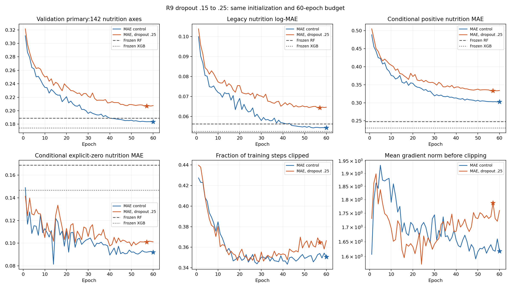

# 第9项候选：192维模型dropout .15→.25

本节完成训练、独立重放、曲线及全部142轴、分区与40条本地案例审阅；结论是拒绝此固定dropout配方，不代表研究目标已经达成。

## 1. 研究问题与预先假设

上一2e-4候选整体训练拟合和91/142轴点改善，却未通过主指标筛选，低支持轴抵消常见轴收益。本轮在3e-4控制上仅提高dropout以检验正则化假设；稀疏轴拟合趋势混合，不预设过拟合或曝光不足是原因。

## 2. 父版本与唯一方法改动

唯一因素为共享dropout .15→.25，覆盖14处注意力概率、前馈/残差和预测头配置，包括保留调用顺序的非活动presence head。192维、3层、6头、FF768、rank16、直接MAE、来源校准权重1、AdamW lr3e-4与weight_decay1e-4、batch64、clip1、种子20260922、任务和60轮不变。初值、参数量、学习率及每步衰减日程相同，训练随机函数及梯度预期不同；不能归因于某一层dropout的独立作用。

## 3. 可复现信息与实际成本

|Item|Value|
|---|---|
|Code commit|f387172b1c9c6e507e3844d229df51e3bd1ca20b|
|Checkpoint SHA256|ea41588d48a1810ee94544c45332abe9273c7b9de61e594d36edbb07e9d71f90|
|Shared initial-state SHA256|eedddcd2b1ef26824401f65ad7fe72fa3dc003a2d12298bd7a596d92f6a0b3fe|
|Data SHA256|48aa0b22a816cc175c8d274628a747ca44a90339bda46d33aada7cee9ea9d923|
|Panel SHA256|3e8714b9d0033372c1eefe96e7536b440c90d2151cb434d3219d45251025549a|
|Name cache SHA256|db361b9bcd3aa4d9b37c31a01ee08140c29976989b0e78b3ae6e8be3dfa6c12a|
|Total / requires_grad parameters|1548594 / 1515929|
|Seed|20260922|
|Selected epoch|57|
|Completed epochs|60|
|Run elapsed (s)|9487.234|
|Full training-fit inference (s)|51.687|
|Pre-run estimate (s)|11236.425|
|Follow-up interval (min)|198|
|Configured dropout sites verified|14|
|Pretraining tests passed|33|

环境保持Windows、Python3.10.19、PyTorch2.7.1+cu128和RTX5070Ti16GB。按4项完整同规模运行耗时中位数×1.15估时，另留10分钟，安排198分钟回访，不逐轮观察epoch。进程身份按Windows接口共同微秒精度核对，保留原时间。训练耗时不含功能诊断与人工准备；机器负载未受控，不据用时差异宣称算法加速。

[Registration](PLAN.md) · [Configuration](config.json) · [Version](README.md) · [Launch](launch.json) · [Functional check](../../../../reports/v9_r9_drop25_functional_v1/verification.json) · [Preparation](../../../../reports/v9_r9_drop25_preparation_v1/verification.json) · [Analysis](../../../../reports/v9_r9_drop25_analysis_v1/summary.json) · [Training fit](../../../../reports/v9_r9_drop25_fit_v1/summary.json)

## 4. 完整三任务结果与固定参照

MAE是同种子dropout .15、lr3e-4控制，DROP25为dropout .25候选。RF/XGB/KNN为冻结产物。各神经模型的三任务来自其补全选择的同一检查点；本节单种子不与第6节三种子确认结果混用。

**补全 / Completion**

|Method|142-axis scaled-log MAE|Legacy log-MAE|Raw MAE (g/100g)|Positive MAE|Explicit-zero MAE|
|---|---|---|---|---|---|
|MAE|0.183553|0.054362|0.330240|0.302773|0.092039|
|DROP25|0.206847|0.064430|0.399232|0.333198|0.101009|
|RF32|0.189031|0.056270|0.321219|0.248086|0.168645|
|XGB32|0.174487|0.052593|0.298575|0.230310|0.146588|

**仅名称 / Name-only**

|Method|142-axis scaled-log MAE|Legacy log-MAE|Raw MAE (g/100g)|Positive MAE|Explicit-zero MAE|
|---|---|---|---|---|---|
|MAE|0.426411|0.154190|0.977888|0.552216|0.385183|
|DROP25|0.465236|0.167111|1.003214|0.588603|0.425087|
|RF32|0.659518|0.213824|1.134940|0.695565|0.730742|
|XGB32|0.656148|0.213719|1.173381|0.693838|0.718390|
|KNN32|0.262260|0.089088|0.502782|0.338107|0.246578|

**45/187 axes**

|Method|Task|Subset|Axes|Scaled-log MAE|
|---|---|---|---|---|
|MAE|completion|food_metabolome|45|0.598022|
|MAE|completion|all|187|0.283292|
|MAE|name_only|food_metabolome|45|0.749716|
|MAE|name_only|all|187|0.504212|
|DROP25|completion|food_metabolome|45|0.609422|
|DROP25|completion|all|187|0.303723|
|DROP25|name_only|food_metabolome|45|0.972935|
|DROP25|name_only|all|187|0.587409|
|RF32|completion|food_metabolome|45|0.674196|
|RF32|completion|all|187|0.305782|
|RF32|name_only|food_metabolome|45|0.889240|
|RF32|name_only|all|187|0.714798|
|XGB32|completion|food_metabolome|45|0.674273|
|XGB32|completion|all|187|0.294756|
|XGB32|name_only|food_metabolome|45|0.851545|
|XGB32|name_only|all|187|0.703168|
|KNN32|name_only|food_metabolome|45|0.702450|
|KNN32|name_only|all|187|0.368188|

**检索 / Retrieval**

|Method|Visible fraction|Recall@1|Recall@5|Recall@10|MRR|
|---|---|---|---|---|---|
|MAE|0.3|0.000465|0.003452|0.006781|0.003381|
|MAE|1.0|0.001023|0.006003|0.010603|0.005720|
|DROP25|0.3|0.000310|0.002297|0.003613|0.002306|
|DROP25|1.0|0.000470|0.003795|0.007223|0.003906|
|RF32|0.3|0.000310|0.001239|0.001987|0.001477|
|RF32|1.0|0.000176|0.001566|0.004457|0.002528|
|XGB32|0.3|0.000310|0.001471|0.001819|0.001559|
|XGB32|1.0|0.000423|0.002468|0.006275|0.003417|
|KNN32|0.3|0.005149|0.054796|0.096722|0.034512|
|KNN32|1.0|0.013005|0.117573|0.193572|0.068879|

固定49,913个候选名称，名称向量由名称预测营养得到，不读取候选真实营养；营养查询不含名称。正确答案按原始名称精确匹配，尚无已确认别名映射。区间以食物候选组为单位并条件于这些选定检查点；不覆盖训练种子总体、标签真实性或反复选择的不确定性。以下营养相对改善为正表示误差下降，检索差值为正表示候选排名指标提高。

|Reference|Task|Metric|DROP25 gain (%)|95% lower (%)|95% upper (%)|
|---|---|---|---|---|---|
|mae_parent|completion|scaled_log_mae|-12.690256|-15.873943|-9.682389|
|mae_parent|completion|log_mae|-18.518971|-23.968517|-13.801157|
|mae_parent|name_only|scaled_log_mae|-9.104875|-12.274917|-5.998208|
|mae_parent|name_only|log_mae|-8.379974|-14.582007|-2.801114|
|rf32|completion|scaled_log_mae|-9.424765|-12.919938|-6.061026|
|rf32|completion|log_mae|-14.500785|-19.872345|-8.953607|
|rf32|name_only|scaled_log_mae|29.458216|27.218948|31.874090|
|rf32|name_only|log_mae|21.846404|18.115438|25.740185|
|xgb32|completion|scaled_log_mae|-18.545738|-22.310514|-14.746352|
|xgb32|completion|log_mae|-22.506484|-29.867898|-15.074953|
|xgb32|name_only|scaled_log_mae|29.095893|26.727539|31.518700|
|xgb32|name_only|log_mae|21.808104|17.814790|25.640772|
|knn32|name_only|scaled_log_mae|-77.394815|-83.099840|-71.628387|
|knn32|name_only|log_mae|-87.579725|-98.789236|-77.403903|

|Reference|Visible fraction|Metric|DROP25 minus reference|95% lower|95% upper|
|---|---|---|---|---|---|
|mae_parent|0.3|mrr|-0.001076|-0.001960|-0.000266|
|mae_parent|0.3|recall_at_1|-0.000155|-0.000774|0.000465|
|mae_parent|0.3|recall_at_5|-0.001155|-0.003072|0.000523|
|mae_parent|0.3|recall_at_10|-0.003168|-0.005440|-0.000826|
|mae_parent|1.0|mrr|-0.001815|-0.002894|-0.000760|
|mae_parent|1.0|recall_at_1|-0.000552|-0.001387|0.000282|
|mae_parent|1.0|recall_at_5|-0.002208|-0.004297|-0.000159|
|mae_parent|1.0|recall_at_10|-0.003380|-0.006127|-0.000525|
|rf32|0.3|mrr|0.000829|0.000099|0.001530|
|rf32|0.3|recall_at_1|0.000000|-0.000542|0.000542|
|rf32|0.3|recall_at_5|0.001058|-0.000259|0.002478|
|rf32|0.3|recall_at_10|0.001626|0.000013|0.003343|
|rf32|1.0|mrr|0.001378|0.000648|0.002152|
|rf32|1.0|recall_at_1|0.000294|-0.000176|0.000870|
|rf32|1.0|recall_at_5|0.002229|0.000834|0.003743|
|rf32|1.0|recall_at_10|0.002766|0.000471|0.005262|
|xgb32|0.3|mrr|0.000747|0.000049|0.001434|
|xgb32|0.3|recall_at_1|0.000000|-0.000542|0.000544|
|xgb32|0.3|recall_at_5|0.000826|-0.000619|0.002221|
|xgb32|0.3|recall_at_10|0.001794|0.000077|0.003536|
|xgb32|1.0|mrr|0.000488|-0.000370|0.001441|
|xgb32|1.0|recall_at_1|0.000047|-0.000588|0.000752|
|xgb32|1.0|recall_at_5|0.001326|-0.000370|0.002909|
|xgb32|1.0|recall_at_10|0.000949|-0.001587|0.003582|
|knn32|0.3|mrr|-0.032207|-0.034509|-0.029917|
|knn32|0.3|recall_at_1|-0.004839|-0.006620|-0.003277|
|knn32|0.3|recall_at_5|-0.052499|-0.057777|-0.047502|
|knn32|0.3|recall_at_10|-0.093109|-0.099936|-0.086313|
|knn32|1.0|mrr|-0.064973|-0.068647|-0.061757|
|knn32|1.0|recall_at_1|-0.012535|-0.015329|-0.010160|
|knn32|1.0|recall_at_5|-0.113778|-0.121466|-0.106836|
|knn32|1.0|recall_at_10|-0.186348|-0.195789|-0.177949|

## 5. 机制诊断与功能核验

|Fixed-denominator component|DROP25 minus MAE|
|---|---|
|positive_under|0.012579|
|positive_over|0.009290|
|explicit_zero|0.001425|

|Method|Partition|142-axis MAE|Positive MAE|Explicit-zero MAE|
|---|---|---|---|---|
|MAE|train|0.134937|0.250149|0.054250|
|MAE|validation|0.183553|0.302773|0.092039|
|DROP25|train|0.162434|0.285228|0.070357|
|DROP25|validation|0.206847|0.333198|0.101009|

|Method|First 10 clip fraction|Last 10 clip fraction|Selected epoch|Elapsed (s)|
|---|---|---|---|---|
|MAE|0.401310|0.350883|60|12254.359|
|DROP25|0.400721|0.363736|57|9487.234|

正值低估、高估及显式零采用同一主指标分母，精确重构主误差变化；条件正值/零值平均的分母不同，不能直接相加。全部1,828,536训练目标使用无来源残差的基础推理，既有MAE训练预测只重新评分。实际曲线显示主误差、旧log与正值误差长期高于控制；后段零值误差、裁剪比例与平均裁剪前梯度也更高，没有数值发散。

|Aggregate axis check|Count|
|---|---|
|Nutrition axes|142|
|Axes point better than MAE|13|
|Unadjusted interval supports improvement|3|
|Unadjusted interval supports regression|107|
|Validation support below30|9|
|Axes point better than frozen RF|42|
|Amino-acid axes point worse than MAE|20|

[All axis contrasts](../../../../reports/v9_r9_drop25_axis_changes_v1/axis_changes.csv) · [All source/family/support partitions](../../../../reports/v9_r9_drop25_analysis_v1/drop25_minus_mae_partitions.csv) · [Case checks](../../../../reports/v9_r9_drop25_cases_v1/summary.json)

轴区间没有多重检验校正；稀疏轴须连同支持数解读。40条案例是对冻结RF误差差值的两端，已核对键、标签、预测和元数据；不代表总体或独立样本，不据此修正或排除标签。原始食物级数值仅保存在本地。

|Functional exercise|Value|
|---|---|
|Training batch tasks|32|
|Diagnostic steps|50|
|Loss before|0.217358|
|Loss after|0.062787|

训练前33项测试通过。真实训练行默认GPU预检确认同初始权重与构造RNG、评估前向/损失一致，全部14处dropout为控制.15、候选.25。匹配起始RNG后，训练损失及梯度按预期不同，梯度有限、RNG消耗一致。隐藏标签和来源不影响基础前向，未观测轴可查询，8训练名称×187轴有限，初始与已学重载一致。正式后端保持默认；这些检查不是GPU轨迹确定性或验证性能证据。

观察事实：补全误差增加0.023293381，其中正值低估贡献+0.012578782、正值高估+0.009289540、显式零+0.001425059。训练同口径误差从0.134937增至0.162434（+0.027497173）。仅13/142轴点改善，未校正区间支持3轴改善、107轴退步；24来源中仅1个贡献改善，全部10个家族贡献退步。常见/中等/稀疏轴贡献均退步（+0.015204、+0.002461、+0.005628）。7个稀疏轴训练全部变差，验证仅Menaquinone-4改善。因而失败并非只由少量稀疏轴抵消广泛收益。

案例审阅：20个较好案例包含10个正值、10个显式零，来自4来源、12食品组；20个较差案例均为FooDB正值，16个Cholesterol、4个Biotin，来自18食品组。16个胆固醇预测至少比保留标签低500倍。它们是预先固定的极端尾部检查，不能据此认定标签错误或数据库质量，更未修改数据。

对照支持的解释：提高共享dropout在此预算下同时损害训练拟合和验证表现，不支持本轮正则化假设。优化不足、特征表达受扰、来源组成和标签问题均未被单独隔离，不能只称为“过拟合”或把失败唯一归因于某一dropout位置。

## 6. 因果解释边界

本次比较共享dropout配置整体干预，不能识别某个位置的独立作用。初始参数与评估函数一致不意味着训练函数或后续路径相同，正式GPU也不保证确定性。训练/验证食品和支持不同，拟合差距不能单独证明过拟合。实际解读需区分事实、对照证据与替代解释。

## 7. 筛选与版本决定

|Registered screening gate vs same-seed MAE|Pass|
|---|---|
|primary_point_improves_over_same_seed_mae|False|
|paired_interval_supports_improvement|False|
|legacy_regression_at_most_2percent_vs_mae|False|

三个筛选条件全部失败；拒绝此固定配方，保留原MAE192控制。补全、名称和检索同时退步，不选择其中另一检查点拼接能力。

最新用户指令已停止种子及超参数搜索，本候选不追加种子。单种子局部结论不构成稳定超越RF或外部泛化证明；失败完整保留。

## 8. 下一轮问题与测试状态

研究方向已转为结构对照；后续RMSNorm单独登记并完成，其结果在下一快照报告。数据、树参照和测试状态不变，不将本轮失败推广为所有正则化无效。
