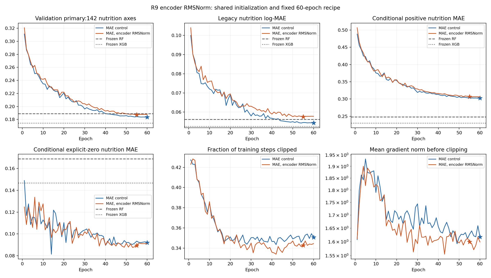

# R9-A1 / 候选10：编码器RMSNorm

## 1. 研究问题与预先假设

检验取消编码器通道均值中心化、使用RMS归一化能否改善正值拟合与补全。已有Pre-LN保留，仅替换归一化构件。[RMSNorm原论文](https://arxiv.org/abs/1910.07467)提供质量与效率证据，[LLaMA §2.2](https://arxiv.org/html/2302.13971v1#S2.SS2)记录其采用；这些研究不保证营养任务收益。

## 2. 父版本与结构改动

对照为原MAE192/lr3e-4/dropout.15，而非上一dropout候选。3层各2处加最终输出，共7处LayerNorm改为RMSNorm，eps仍为1e-5，FP32；文本投影LayerNorm不变。取消这7处偏置，参数减少1344，其余初始张量及构造RNG完全相同。固定192维、3层、6头、FF768、MAE、dropout.15、lr3e-4、AdamW/wd1e-4、batch64、clip1、seed20260922、60轮余弦、训练来源残差。双向集合注意力不变。

## 3. 可复现信息、失败与成本

|Item|Value|
|---|---|
|Training commit|641d1795de2bcf16de74be60c6bf7ecb932098ef|
|Checkpoint SHA256|51725808b57825850616c6e3b66654ef6c7faa4697a3432c2703966429275707|
|Data SHA256|48aa0b22a816cc175c8d274628a747ca44a90339bda46d33aada7cee9ea9d923|
|Panel SHA256|3e8714b9d0033372c1eefe96e7536b440c90d2151cb434d3219d45251025549a|
|Name cache SHA256|db361b9bcd3aa4d9b37c31a01ee08140c29976989b0e78b3ae6e8be3dfa6c12a|
|Seed / selected epoch / epochs|20260922 / 55 / 60|
|Total / trainable parameters|1547250 / 1514585|
|Training seconds|11875.859|
|Pre-run estimate seconds|11391.554|
|Training-fit inference seconds|55.437|
|Wake delay minutes|205|
|Preflight tests|30|

Windows/Python3.10.19/PyTorch2.7.1+cu128/RTX5070Ti16GB；每轮337048任务、1828536观测目标。完整重放检查两份323809行预测、49913候选向量和19089检索排名，全部60轮学习率、顺序、曝光与父相同。预计11391.554秒，实际11875.859秒，不能以非受控用时推断算法效率。9月30日04:11（北京时间）启动，07:31队列结束，07:37定时回访核验退出；没有epoch监视循环。

预检失败已保留：默认融合LayerNorm与显式实现最大绝对差5.56335e-5超出原容差，正式训练尚未启动。config_v2修订只在诊断中统一非融合路径，要求逐值相等，随后恢复默认后端；训练spec没有改变。小批次50步损失0.170336→0.064700，初始/已学重载、隐藏标签/来源隔离、未观测轴和name-only候选检查通过。启动凭据解析曾因Windows七位小数时间戳失败，按共同微秒精度修复，未重启训练；这与模型失败不同。

[Plan](PLAN.md) · [Config](config_v2.json) · [Launch](launch.json) · [Preflight revision](PREFLIGHT_REVISION.md) · [Audit](../../../../reports/v9_r9_rmsnorm_60_audit_v1/verification.json)

训练命令（在仓库根目录执行；已完成，不应重复启动）：

```powershell
.\.venv\Scripts\python.exe -X utf8 scripts/train_foodnutrigpt_v9_r9_rmsnorm.py --candidate tf192_mae_rmsnorm_lr3e4_60 --output-dir output/v9_r9_methods/tf192_mae_rmsnorm_lr3e4_60
```

## 4. 完整结果与固定参照

以下所有任务使用第55轮同一检查点。误差越低越好；检索为0–1比例，越高越好。各模型是冻结产物，MAE是同种子父模型。

**营养补全**

|Method|142-axis scaled-log MAE|Legacy log-MAE|Raw MAE (g/100g)|Positive MAE|Explicit-zero MAE|
|---|---|---|---|---|---|
|MAE|0.183553|0.054362|0.330240|0.302773|0.092039|
|RMSNORM|0.187225|0.057580|0.351747|0.306402|0.089347|
|RF32|0.189031|0.056270|0.321219|0.248086|0.168645|
|XGB32|0.174487|0.052593|0.298575|0.230310|0.146588|

**仅名称预测**

|Method|142-axis scaled-log MAE|Legacy log-MAE|Raw MAE (g/100g)|Positive MAE|Explicit-zero MAE|
|---|---|---|---|---|---|
|MAE|0.426411|0.154190|0.977888|0.552216|0.385183|
|RMSNORM|0.421303|0.150270|0.885119|0.536834|0.435816|
|RF32|0.659518|0.213824|1.134940|0.695565|0.730742|
|XGB32|0.656148|0.213719|1.173381|0.693838|0.718390|
|KNN32|0.262260|0.089088|0.502782|0.338107|0.246578|

**独立轴集合**

|Method|Task|Subset|Axes|Scaled-log MAE|
|---|---|---|---|---|
|MAE|completion|food_metabolome|45|0.598022|
|MAE|completion|all|187|0.283292|
|MAE|name_only|food_metabolome|45|0.749716|
|MAE|name_only|all|187|0.504212|
|RMSNORM|completion|food_metabolome|45|0.599615|
|RMSNORM|completion|all|187|0.286463|
|RMSNORM|name_only|food_metabolome|45|0.825765|
|RMSNORM|name_only|all|187|0.518633|
|RF32|completion|food_metabolome|45|0.674196|
|RF32|completion|all|187|0.305782|
|RF32|name_only|food_metabolome|45|0.889240|
|RF32|name_only|all|187|0.714798|
|XGB32|completion|food_metabolome|45|0.674273|
|XGB32|completion|all|187|0.294756|
|XGB32|name_only|food_metabolome|45|0.851545|
|XGB32|name_only|all|187|0.703168|
|KNN32|name_only|food_metabolome|45|0.702450|
|KNN32|name_only|all|187|0.368188|

**名称检索**

|Method|Visible fraction|Recall@1|Recall@5|Recall@10|MRR|
|---|---|---|---|---|---|
|MAE|0.3|0.000465|0.003452|0.006781|0.003381|
|MAE|1.0|0.001023|0.006003|0.010603|0.005720|
|RMSNORM|0.3|0.000000|0.001045|0.003368|0.002252|
|RMSNORM|1.0|0.000302|0.003617|0.007099|0.004204|
|RF32|0.3|0.000310|0.001239|0.001987|0.001477|
|RF32|1.0|0.000176|0.001566|0.004457|0.002528|
|XGB32|0.3|0.000310|0.001471|0.001819|0.001559|
|XGB32|1.0|0.000423|0.002468|0.006275|0.003417|
|KNN32|0.3|0.005149|0.054796|0.096722|0.034512|
|KNN32|1.0|0.013005|0.117573|0.193572|0.068879|

|Reference|Task|Metric|RMSNORM gain (%)|95% lower (%)|95% upper (%)|
|---|---|---|---|---|---|
|mae_parent|completion|scaled_log_mae|-2.000086|-4.457605|0.181119|
|mae_parent|completion|log_mae|-5.919348|-10.924737|-1.438134|
|mae_parent|name_only|scaled_log_mae|1.198055|-1.399783|3.690927|
|mae_parent|name_only|log_mae|2.542052|-2.326149|7.398031|
|rf32|completion|scaled_log_mae|0.955630|-1.577984|3.478258|
|rf32|completion|log_mae|-2.328330|-8.201136|2.756542|
|rf32|name_only|scaled_log_mae|36.119578|34.172707|38.120113|
|rf32|name_only|log_mae|29.722356|26.552796|32.682374|
|xgb32|completion|scaled_log_mae|-7.300097|-10.587784|-3.974411|
|xgb32|completion|log_mae|-9.482953|-16.430508|-2.579582|
|xgb32|name_only|scaled_log_mae|35.791470|33.721344|37.816020|
|xgb32|name_only|log_mae|29.687916|26.318256|32.681543|
|knn32|name_only|scaled_log_mae|-60.643168|-65.407102|-55.359156|
|knn32|name_only|log_mae|-68.676320|-78.290835|-59.329227|

|Reference|Visible fraction|Metric|RMSNORM minus reference|95% lower|95% upper|
|---|---|---|---|---|---|
|mae_parent|0.3|mrr|-0.001130|-0.001908|-0.000358|
|mae_parent|0.3|recall_at_1|-0.000465|-0.001007|-0.000077|
|mae_parent|0.3|recall_at_5|-0.002407|-0.003975|-0.000851|
|mae_parent|0.3|recall_at_10|-0.003413|-0.005517|-0.000889|
|mae_parent|1.0|mrr|-0.001516|-0.002576|-0.000578|
|mae_parent|1.0|recall_at_1|-0.000720|-0.001496|0.000000|
|mae_parent|1.0|recall_at_5|-0.002386|-0.004490|-0.000235|
|mae_parent|1.0|recall_at_10|-0.003504|-0.006570|-0.000756|
|rf32|0.3|mrr|0.000775|0.000162|0.001373|
|rf32|0.3|recall_at_1|-0.000310|-0.000774|0.000000|
|rf32|0.3|recall_at_5|-0.000194|-0.001239|0.000890|
|rf32|0.3|recall_at_10|0.001381|-0.000194|0.003110|
|rf32|1.0|mrr|0.001676|0.000951|0.002418|
|rf32|1.0|recall_at_1|0.000126|-0.000282|0.000569|
|rf32|1.0|recall_at_5|0.002051|0.000528|0.003686|
|rf32|1.0|recall_at_10|0.002642|0.000198|0.004840|
|xgb32|0.3|mrr|0.000693|0.000065|0.001274|
|xgb32|0.3|recall_at_1|-0.000310|-0.000774|0.000000|
|xgb32|0.3|recall_at_5|-0.000426|-0.001510|0.000774|
|xgb32|0.3|recall_at_10|0.001548|-0.000142|0.003252|
|xgb32|1.0|mrr|0.000786|-0.000080|0.001658|
|xgb32|1.0|recall_at_1|-0.000121|-0.000705|0.000463|
|xgb32|1.0|recall_at_5|0.001148|-0.000545|0.002959|
|xgb32|1.0|recall_at_10|0.000824|-0.001619|0.003338|
|knn32|0.3|mrr|-0.032261|-0.034621|-0.029903|
|knn32|0.3|recall_at_1|-0.005149|-0.006904|-0.003587|
|knn32|0.3|recall_at_5|-0.053751|-0.059097|-0.048662|
|knn32|0.3|recall_at_10|-0.093354|-0.099902|-0.086563|
|knn32|1.0|mrr|-0.064675|-0.068319|-0.061672|
|knn32|1.0|recall_at_1|-0.012703|-0.015367|-0.010259|
|knn32|1.0|recall_at_5|-0.113956|-0.121763|-0.107134|
|knn32|1.0|recall_at_10|-0.186472|-0.195539|-0.177764|

补全主误差0.187225，较父退步2.000%（改善95%区间−4.458%～+0.181%）；旧log退步5.919%，其区间支持退步。较RF点改善0.956%（−1.578%～+3.478%），较XGB退步7.300%（改善区间−10.588%～−3.974%）。Name-only 0.421303比父低1.198%，区间−1.400%～+3.691%，证据不足；相对KNN误差仍高60.643%。全部8项检索指标点退步，7项区间上界小于0，完整R@1区间上界恰为0。完整R@10 0.007099、30% R@10 0.003368，不能称为良好反向名称预测。

食品组配对重采样1000次；7344补全组，检索完整/30%分别7090/6458组。固定49913候选名称只由名称预测营养，不使用候选真实营养；查询不含名称。答案为精确原名称，未确认别名映射。区间不涵盖种子总体、标签真实性或反复验证选点。

## 5. 机制诊断

|Fixed-denominator component|RMSNORM minus MAE|
|---|---|
|positive_under|0.005743|
|positive_over|-0.001942|
|explicit_zero|-0.000130|

|Method|Partition|142-axis MAE|Positive MAE|Explicit-zero MAE|
|---|---|---|---|---|
|MAE|train|0.134937|0.250149|0.054250|
|MAE|validation|0.183553|0.302773|0.092039|
|RMSNORM|train|0.140616|0.257341|0.055612|
|RMSNORM|validation|0.187225|0.306402|0.089347|

|Method|First 10 clip fraction|Last 10 clip fraction|Selected epoch|Elapsed (s)|
|---|---|---|---|---|
|MAE|0.401310|0.350883|60|12254.359|
|RMSNORM|0.401595|0.343497|55|11875.859|



共同分母变化：正值低估+0.005743362、高估−0.001941824、显式零−0.000130315，合计+0.003671223。条件正值误差变差、零值略好；不能把不同分母的条件均值直接相加。训练同口径误差0.134937→0.140616（+0.005679225），训练和验证均变差。曲线没有发散，后段裁剪比例0.343497低于控制0.350883，平均裁剪前梯度也较低；较低梯度幅度没有转为更好补全。

42/142轴点改善，未校正区间支持2轴改善、22轴退步；9轴验证支持数不足30，14/20氨基酸轴点退步。24来源中8个贡献改善、16个退步；FooDB贡献+0.001503，但不据此评判数据库质量。常见/中等/稀疏轴贡献分别+0.002520、−0.000651、+0.001802，退步并非只有稀疏轴。7个稀疏轴中3个训练改善、4个验证改善，趋势混合；Cellulose训练0.074063→0.053935、验证0.482925→0.546576，不能统一解释成训练不足。

实际审阅40条固定极端案例：20个较好案例为12正值/8零值，来自5来源、15食品组；20个较差案例来自FooDB、18组，其中17胆固醇、2生物素、1月桂酸，含19正值/1零值。17胆固醇预测均至少比保留标签低500倍；这延续标签尺度疑点，但没有原始证据不能判定数值错误。模型对部分椰子脂肪酸有收益，也存在零标签月桂酸严重高估，不能只以“预测偏低”概括全部失败。

[All 142 axis contrasts](../../../../reports/v9_r9_rmsnorm_axis_changes_v1/axis_changes.csv) · [Source/family/support partitions](../../../../reports/v9_r9_rmsnorm_analysis_v1/rmsnorm_minus_mae_partitions.csv) · [Training/validation by axis](../../../../reports/v9_r9_rmsnorm_fit_v1/per_axis_fit.csv) · [Case audit](../../../../reports/v9_r9_rmsnorm_cases_v1/summary.json)

|Evaluation-only learned LayerNorm bridge|Value|
|---|---|
|Primary error change|0.000005322212|
|Max cell scaled prediction difference|0.034031850|
|All learned weights unchanged|True|
|New optimization or selection|False|

结果后补充诊断使用父模型同一已学权重，仅改为显式LayerNorm执行，重新评分全部323809任务。主指标变化仅+0.000005322，相比RMSNorm总变化+0.003671223较小；但最大单元缩放预测差为0.034032，不声称每个预测逐位相等。这支持“仅评估融合路径数值差不足以解释总体退步”，不控制训练轨迹的所有数值扰动。

[Numerical bridge](../../../../reports/v9_r9_rmsnorm_bridge_v1/summary.json)

## 6. 因果分析

事实：固定配方下RMSNorm训练拟合与补全更差，正值低估增加，name-only点改善未获区间支持，检索退步。对照支持：这一7处归一化整体替换未改善本任务，不支持预先假设。尚未排除：取消中心化、RMS缩放、偏置去除的各自作用，固定预算下的优化适配、来源/标签差异和随机轨迹；不能据此断言RMSNorm在所有营养模型中无效。也不能仅凭较小梯度说训练更稳定或更优。

## 7. 版本决定

|Registered screening gate vs same-seed MAE|Pass|
|---|---|
|primary_point_improves_over_same_seed_mae|False|
|paired_interval_supports_improvement|False|
|legacy_regression_at_most_2percent_vs_mae|False|

拒绝用RMSNorm替换父模型，保留LayerNorm-MAE192作为后续结构控制。保留全部结果和失败；没有追加种子，也没有更换学习率、dropout、损失或维度来挽救候选。报告完成不等于模型目标达成。

## 8. 下一轮问题与测试状态

下一项最小结构问题是SwiGLU乘法门控前馈是否改善输入相关的数值变换；仍以原LayerNorm父模型为对照，不把RMSNorm合并进去。保持FF宽度768及其他配方，新增门控矩阵将增加参数，必须明确披露，不能把收益唯一归因于门控。先独立登记和功能核验再训练；本报告时尚未启动。测试、数据和RF/XGB冻结，未来仍需来源留出与少样本迁移证据。
