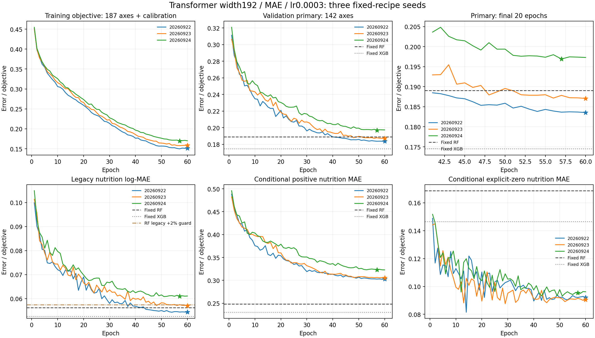
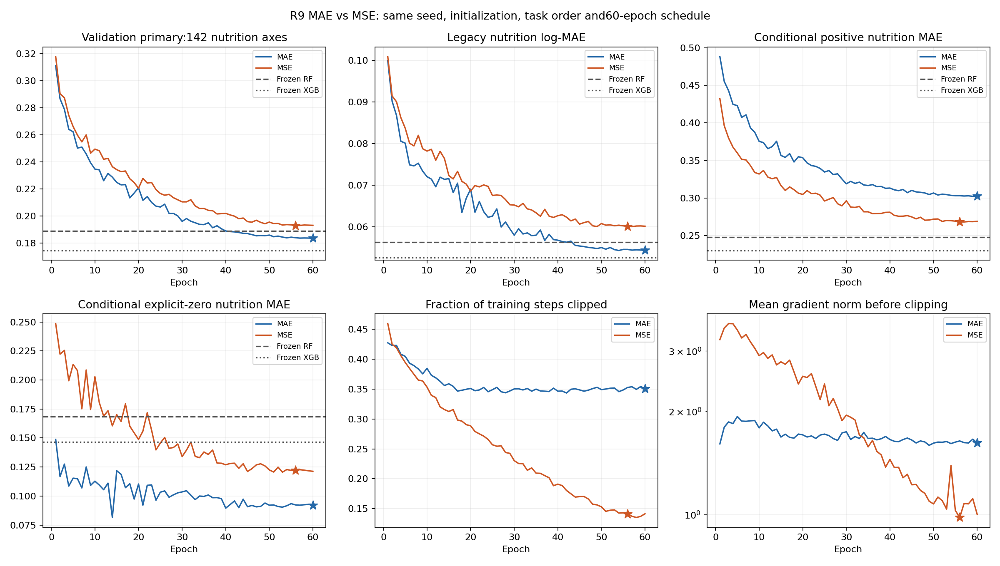
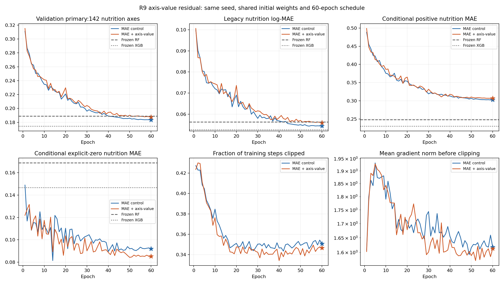
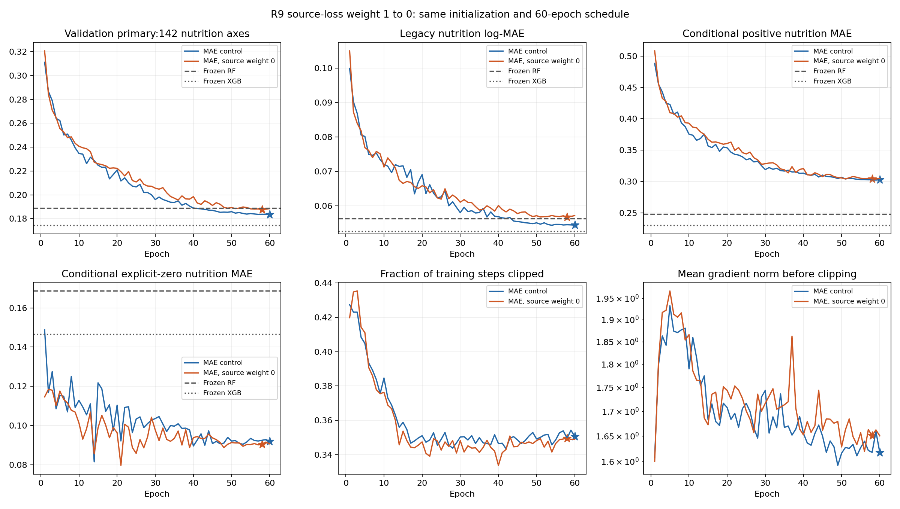
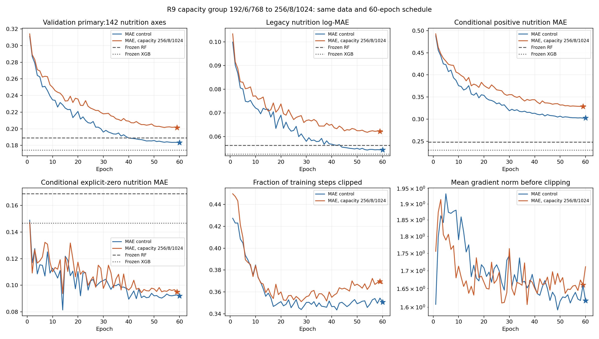
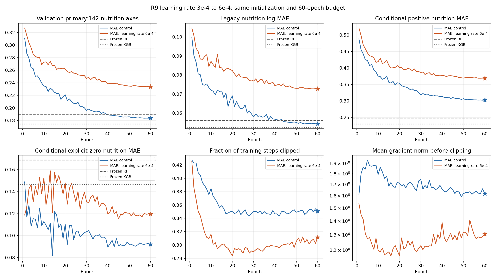
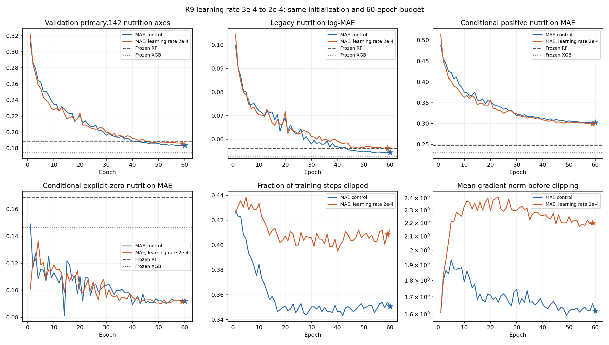

# 营养表征模型综合研究报告：R0–R9

对应英文：[REPORT_EN.md](REPORT_EN.md)。本报告整理完整实验与验证证据；内部验证结论不等于外部泛化或标签真实性证明。

版本范围：R0–R9完整阶段报告，包含MAE三种子复验，以及MSE、轴×数值残差、关闭来源校准、PDF容量组合和两次学习率筛选。六个追加配方均未通过接受条件；方法控制仍为192维MAE、学习率3e-4、source weight=1。第2–14节保留已审阅历史，第15节为最新2e-4实验。整体Transformer优于冻结RF的目标仍未达到。

## 1. 研究目标与主要结论

目标是在冻结数据与RF/XGBoost结果的条件下，通过有验证依据的单阶段Transformer方法改善营养补全，同时跟踪仅名称预测和营养到名称检索。每次迭代保留假设、全部结果、失败与归因边界，不拼接不同模型的最好任务成绩。

192维MAE控制的三种子补全主误差为0.189184 ± 0.006925，固定RF为0.189031；食品组改善区间跨零，旧log均值退步超过2%保护条件，尚无稳定超越RF的证据。数据来源、历史迭代和具体基线方法见第2–14节。

最新学习率3e-4→2e-4实验完成60轮，选中第59轮。补全主误差0.185954，较控制0.183553退步1.308%，改善区间[−4.533%,+1.711%]跨零；旧log-MAE点退步3.202%。相对RF点改善1.627%，区间[−1.992%,+4.909%]仍跨零；相对XGB退步6.572%。三个筛选条件均失败，拒绝此固定配方，不追加23/24种子。

本轮91/142轴点改善，但7个少于100训练组的轴贡献了+0.004935的主误差变化，抵消了115个至少1000训练组轴的−0.002620。训练整体拟合改善，稀疏轴却并非一致改善，不能仅凭总训练误差宣称普遍过拟合或训练不足。仅名称主误差退步3.320%，检索8项指标均点退步但区间跨零；详细分析见第15节。

## 2. 数据来源、实际训练数据与标签可信度

### 2.1 直接数据来源与上游来源

代码起点为[Representation-model](https://github.com/mz1622/Representation-model)，父提交`1289d38129dffb7d3490239fb516328fa5c905e3`。本次直接使用用户提供的`foodnutrigpt_v8_source_native_baseline.tar.gz`，保持原包和V8产物不变。该包记录25个来源、76915个源档案、2259178条原始观测；这些数目不等于本次训练样本数。

实际研究视图只载入训练与验证：64700/11175档案，分别42282/7409个完全同名候选组、24个来源。USDA Foundation的395个保留档案属于原包测试来源；原包完整测试含659档案，另有381个Foundation同名重叠档案排除。以上测试信息仅来自原包划分元数据，本轮没有加载测试标签作模型评价。原历史测试已有上游研究结果，因此即便未来打开也不能称为从未被研究过的新外部数据。

以下训练/验证数量由隔离视图重新统计。来源链接用于识别数据库家族；后续下载清单可能对应更新版本，**链接不证明V8使用了该网站当前版本，也不替代逐记录原始溯源**。

|数据源 / Source|训练档案 / Train profiles|验证档案 / Validation profiles|训练营养观测单元 / Observed nutrition cells|
|---|---:|---:|---:|
|[Australian Food Composition Database](https://www.foodstandards.gov.au/science-data/food-nutrient-databases/afcd/data-files)|1314|247|35245|
|[FAO/INFOODS AnFooD 2.0](https://www.fao.org/food-composition/tables-and-databases/detail/%28global--2017%29-fao-infoods-analytical-food-composition-database---version-2.0-%28anfood2.0%29/en)|601|72|3979|
|[Bangladesh Food Composition Table 2013](https://www.fao.org/infoods/infoods/tables-and-databases/asia/en/)|437|57|7122|
|[FAO/INFOODS BioFoodComp 4.0](https://www.fao.org/infoods/infoods/food-biodiversity/en/)|959|140|964|
|[German Nutrient Database BLS 4.0](https://blsdb.de/download)|6051|1089|94523|
|[ANSES-Ciqual](https://ciqual.anses.fr/)|2945|521|92130|
|[Canadian Nutrient File](https://food-nutrition.canada.ca/cnf-fce/)|5044|922|298207|
|[UK Composition of Foods Integrated Dataset](https://www.gov.uk/government/publications/composition-of-foods-integrated-dataset-cofid)|2414|423|34126|
|[EFSA EU Food Composition Database (package label: 2013)](https://www.efsa.europa.eu/en/data-report/food-composition)|14621|2324|147914|
|[USDA Food and Nutrient Database for Dietary Studies](https://fdc.nal.usda.gov/data-documentation.html)|4612|790|212152|
|[FooDB](https://foodb.ca/about)|9467|1780|239188|
|[Frida FoodData, Denmark](https://frida.fooddata.dk/)|1167|188|50658|
|[Lesotho Food Composition Table 2006](https://www.fao.org/infoods/infoods/tables-and-databases/africa/en/)|250|40|6153|
|[Japan MEXT Food Composition Tables (package label: 2023)](https://www.mext.go.jp/a_menu/syokuhinseibun/index.htm)|2148|390|80926|
|[Norwegian Food Composition Database](https://www.matvaretabellen.no/en/api/)|1808|287|61542|
|[FAO/INFOODS/IZiNCG PhyFoodComp 1.0](https://www.fao.org/food-composition/tables-and-databases/detail/%28global--2018%29-fao-infoods-izincg-global-food-composition-database-for-phytate---version-1.0-%28phyfoodcomp1.0%29/en)|1879|307|4956|
|[SMILING Cambodia Food Composition Table 2013](https://www.fao.org/infoods/infoods/tables-and-databases/asia/en/)|78|11|1631|
|[SMILING Indonesia Food Composition Table 2013](https://www.fao.org/infoods/infoods/tables-and-databases/asia/en/)|91|17|1182|
|[SMILING Laos Food Composition Table 2013](https://www.fao.org/infoods/infoods/tables-and-databases/asia/en/)|128|12|1790|
|[SMILING Thailand Food Composition Table 2013](https://www.fao.org/infoods/infoods/tables-and-databases/asia/en/)|122|17|1921|
|[SMILING Vietnam Food Composition Table 2013](https://www.fao.org/infoods/infoods/tables-and-databases/asia/en/)|130|32|1562|
|[Swiss Food Composition Database 7.1](https://valeursnutritives.ch/en/downloads/)|1078|168|25800|
|[USDA Standard Reference Legacy](https://fdc.nal.usda.gov/data-documentation.html)|6481|1191|363116|
|[FAO/INFOODS Western Africa Food Composition Table 2019](https://www.fao.org/food-composition/tables-and-databases/detail/food-composition-tables/en)|875|150|28346|
|USDA Foundation Foods（保留来源 / held out）|0|0|0|

来源之间可能存在转载、借用值、配方计算与分析定义差异。来源标签不等于独立实验室测量，24来源也不等于24个统计独立数据集。当前完整别名、翻译与转载链审查尚未完成。

原包身份核验：用户下载包为135,711,396字节，SHA256为`83ee2b50f04963943797aa1818a91f66d0ffaeb7a5bc3c5b2db7a11be6dff792`。10个原生载荷文件与包内清单、本地V8及R0冻结输入指纹一致。此项只验证文件身份，不证明上游发行真实性、授权或营养标签正确。

### 2.2 单位、聚合与隔离

原包数值以g/100g表示；本轮不因常识猜测改动异常值。对同一源档案×轴，统一在原始单位空间取中位数，保留原始观测，不跨来源自动合并。食品候选组仅是划分和权重单元，不当作已确认食品身份。

FooDB存在同档案、同轴正值相差10³/10⁶的记录；Goose fat/Cholesterol案例仍缺原始Content.csv/staging证据，无法确定错误发生位置。隔离64个单元（训练53、验证11，涉及145条原始记录），同时保留未隔离视图用于既有敏感性分析。当前单位解析器对mg/100 g与mg/100g的换算一致，不能因此判定历史加工链无误。湿重/干重、可食部分及化学形式的原始证据仍未全部闭环。

研究视图隔离前含2221276条原始观测、2153204个档案×轴单元；隔离后训练有1829199个已观测252轴单元，其中187轴监督1828536个、142营养轴1795133个。训练营养中显式零388743个。验证有323941个已观测单元，323809个监督目标，其中营养317616个、显式零69271个。

缺失没有进入目标，显式零仍是观测和目标。计算张量中隐藏位置填0，同时使用单独可见标记；这是输入表示，不是把未知标签设成真实零。异常隔离不能证明剩余标签全真，也不能解决所有系统性单位错误。

### 2.3 变换、划分和统一评分

每轴变换为 `t_a(y)=log(1+y/s_a)`，其中`s_a`是仅训练正值拟合、候选组内来源平衡的加权中位数。尺度、词嵌入投影和所有归一化均不使用验证/测试标签拟合。尺度相差极大，所以主要指标在模型比较前固定为142轴宏平均缩放log-MAE；不按某模型获胜选择指标。

评分在候选组×轴×来源内分别取标签和预测的档案中位数，计算该来源误差；再对组内来源等权、食品候选组等权，最后对轴等权。另报告旧log1p(g/100g) MAE、原始单位MAE、正值/显式零条件误差、45轴和187轴。条件正/零MAE分母不同，不能直接相加；机制分解使用原主指标分母。

验证标签、查询、家族遮蔽和权重共享。全部完全同名候选组跨训练/验证隔离通过；近似名称候选不自动合并，现有隔离不等于所有语义近重复均已排除。主指标配对区间用7344个有营养评价支持的食品组，不能把每个营养单元当独立样本。

## 3. 当前 Transformer 训练方法及参数依据

### 数据、目标与输入

沿用R0的`foodnutrigpt_v9_r0_v1 / quarantined`视图：训练64,700个来源原生档案、42,282个名称候选组；验证11,175个档案、7,409个候选组。各部分均覆盖24个来源。当前不修改数据、划分、隔离规则、尺度、任务或名称缓存；RF/XGBoost不再拟合，完整测试保持关闭。原始单位疑点和未确认别名仍是研究局限，不因冻结而得到解决。

252个轴中，142个nutrition轴和45个metabolome轴接受监督，65个轴仅提供已观测上下文。每个档案内同轴的重复记录在原始单位中取中位数，不跨来源合并。缺失值不监督；显式零仍是观测。训练目标为`t_a(y)=log(1+y/s_a)`，`s_a`是训练正值按名称候选组、来源和档案平衡的加权中位数。训练187轴共有1,828,536个已观测目标，其中142个营养轴有1,795,133个目标、388,743个显式零。

名称分支仅使用`original_name`。冻结MiniLM提供384维向量，再使用已存在、仅由训练数据拟合的PCA；保留32个有效方向，放入128个槽位，其余96个为零。选择该输入是为了匹配已经完成的最强共同协议RF32，不是宣称32维最优。数值分支使用252轴的变换值与可见状态；不输入来源、食物分组或加工元数据。

每个训练任务指定一个食品档案和一个化学家族，隐藏整个家族，包括关联形式；损失仅使用其中已观测且可监督的目标。每轮遍历337,048个任务，每个已观测训练目标恰好覆盖一次。没有额外的name-only混合训练；name-only是本组必须报告的推理评估情景，不能描述成已针对其优化的模型。

### 模型结构与数值输出

序列包含1个可学习CLS token、1个名称token和固定的252个轴token，共254个token，不作截断。名称经过LayerNorm及两层GELU投影；每个可见数值经过`1→192→192`的GELU MLP，再加轴嵌入。缺失或隐藏位置用可学习mask向量替代数值编码。所有轴始终存在，查询轴不由真实标签是否存在决定。没有位置嵌入、类型嵌入或来源token。

编码器使用pre-norm Transformer及最终LayerNorm。每个轴的隐藏状态经过共享非线性标量头，并加rank-16的轴残差和轴偏置。直接回归变换后的数值`z_hat`；推理还原为`y_hat=s_a*expm1(max(z_hat,0))`。训练损失使用未经该非负截断的`z_hat`。当前预测不乘正值概率；父实现的presence分支仍构造和调用以保持初始化及dropout随机数消耗顺序，但其参数冻结，输出不进入损失或预测。

|配置字段|值|
|---|---|
|`d_model`|192|
|`n_layers`|3|
|`n_heads`|6|
|`feedforward_dim`|768|
|`dropout`|0.15|
|`axis_residual_rank`|16|
|`parameter_count`|1548594|
|`trainable_parameter_count`|1515929|
|`active_name_dimensions`|32|
|`name_input_slots`|128|
|`batch_size`|64|
|`epochs`|60|
|`schedule_epochs`|60|
|`learning_rate_screening / selected`|0.0001, 0.0003 / 0.0003|
|`weight_decay`|0.0001|
|`gradient_clip`|1.0|
|`source_weight`|1.0|
|`source_residual_l2`|0.0001|
|`eta_min_fraction`|0.01|
|`screening_seed`|20260922|
|`confirmation_seeds`|20260922, 20260923, 20260924|

### 损失、来源校准与优化

令`w_ia=1/(n_sources(g,a)*n_profiles(g,a,s))`，即每个名称候选组与轴内，各来源等总权重，同来源的多个档案再平分；`W_a`是训练轴权重之和。全数据直接回归目标为：

`L_base = (1/187) * sum_a [sum_i w_ia*abs(z_hat_ia-t_a(y_ia)) / W_a]`。

小批量仅累加当前任务的已观测目标，并乘`N_tasks/(batch_tasks*187)`，使用全训练集轴分母；不是对每个小批量内出现的轴重新取平均。训练与评分的聚合不完全相同：评分先在候选组、来源、轴内对档案标签和预测分别取中位数，再计算误差；训练对档案误差加权求和。因此“训练loss等于验证主指标”不是本实验的假设。

来源只参与训练校准：`z_calibrated=z_hat+b_sa`。每轴偏置在训练来源上做算术均值中心化；未见来源偏置为零。总损失为`(L_base + lambda*L_calibrated)/(1+lambda) + rho*mean(R_train^2)`，其中`lambda=1`、`rho=0.0001`，正则项作用于中心化前的训练来源参数表。来源偏置不进入推理。除以`1+lambda`控制两项损失的整体尺度；来源开关的实际收益仍需单独消融。

优化器为AdamW，两个候选仅初始学习率不同；batch64、weight decay 0.0001、梯度范数裁剪1。单阶段60轮，余弦日程`T_max=60`，最低学习率为初始值的0.01。每轮打乱由`seed+epoch`确定。使用float32，不启用混合精度。每轮核对完整任务覆盖、目标数、顺序指纹和冻结文件指纹，并记录裁剪比例及裁剪前梯度范数。NaN/Inf触发失败。

正式优化前，对32个训练任务进行50步过拟合检查；随后恢复模型参数与CPU/CUDA RNG，再创建正式优化器。此检查仅证明实现可以降低小样本训练损失，不证明泛化能力。

### 选点、三项能力与比较

每轮评价固定的完整验证面板，以142轴宏平均scaled-log MAE选择最早严格最小值；同时保存前20轮最优和前60轮最优检查点。20/60比较来自同一60轮余弦轨迹，包含训练预算增加和更多验证选点机会，不能称作独立的纯时长因果实验。

补全隐藏目标整个家族；name-only隐藏全部数值上下文。两项都只在有真实观测的目标上评分，同时报告142/45/187轴、旧log误差、原始单位误差及正值/零值误差。候选组内来源等权，再对食品候选组和轴取平均。

营养→名称检索采用同一检查点的“名称→预测营养→匹配”方法，不是本轮另行训练的对比学习头。49,913个固定候选名称仅从名称生成142轴预测；查询只使用已观测营养，在可见轴上计算变换空间均方距离。报告全可见及固定30%可见两种情景，至少有3个可见营养轴；距离相同按候选顺序确定名次。评价Recall@1/5/10与MRR，正确答案仅为精确原名称；尚无已确认别名表，不能称为语义身份准确率，也不把距离称为概率。

首组筛选种子为20260922；固定配方随后以20260922、20260923、20260924完成三种子复验。食品组配对重采样区间不消除反复验证选点的偏差，也不包含固定RF自身的种子不确定性。接受目标是Transformer主误差均值低于固定RF且配对区间支持改善，旧营养log-MAE相对退步不超过2%；不是要求超过XGBoost。

### 参数依据与尚未回答的问题

|选择|依据|当前允许的解释|
|---|---|---|
|192维、3层、6头、FF768|沿用直接Transformer父实现，功能核验精确匹配|用于建立同输入控制；尚未证明容量最优|
|学习率0.0001/0.0003|预登记单因素比较|同种子、同初值和同任务顺序的完整对照支持选择0.0003；具体收益见第7节|
|60轮及20轮快照|预登记预算诊断|完整嵌套窗口对照支持60轮窗口；不能分离训练时长和额外选点机会|
|直接MAE|旧R2直接回归研究提供动机，当前重建控制|旧输入协议不同，不能直接迁移历史收益归因|
|source weight1、残差正则0.0001|沿用来源校准控制|尚未在当前输入、目标和时长下证明优于关闭校准|
|batch64、裁剪1、weight decay0.0001|固定工程选择及父训练设置|可复现，不称为充分调参后的最优值|
|dropout0.15、rank16|父结构与PDF方法提供动机|尚无当前协议的独立消融支持|
|PCA32、数据及评分|冻结共同输入与比较协议|本轮不调整；不属于可用来求胜的超参数|

PDF给出256维、3层、8头、FF1024及宏轴MSE等方法，但数据合并、监督标签、归一化和评价均不同，初始学习率也未明确。当前只借鉴方法；没有复现其成绩，也不恢复两阶段。后续容量组或MSE干预须先依据首组完整结果另行登记。任何新分支都不自动成为最终配方。

### 复现与证据边界

原始运行实现提交为`b4fd4c1`。后续文档提交不同于训练实现变更；精确代码身份以每个运行的源码快照和哈希为准。环境为Python3.10.19、PyTorch2.7.1+cu128，GPU为RTX5070Ti16GB，训练使用4个CPU线程。实际计算成本以完整运行manifest与history为准，不用计划估时充当实测。

```powershell
.venv/Scripts/python.exe scripts/train_foodnutrigpt_v9_r9_transformer.py --candidate tf192_mae_lr1e4_60 --output-dir output/v9_r9/tf192_mae_lr1e4_60
.venv/Scripts/python.exe scripts/train_foodnutrigpt_v9_r9_transformer.py --candidate tf192_mae_lr3e4_60 --output-dir output/v9_r9/tf192_mae_lr3e4_60
```

上述是已登记运行命令；存在的输出目录拒绝覆盖，不是要求再次启动。完整运行后另有独立评分重放、预算比较、学习率比较及全训练拟合诊断。功能验收已完成，但不能代替这些性能证据。逐轮记录、三项任务、固定配方复验及选择依据汇总在下文；这些证据仍不建立foundation-model迁移能力。

证据索引：[配置](../r9/config.json)、[预登记](../r9/PLAN.md)、[冻结凭据](../../../reports/v9_r9_freeze_v1/manifest.json)、[功能核验](../../../reports/v9_r9_functional_v1/verification.json)、[数据汇总](../../../reports/v9_final_data_evidence_v1/summary.json)、[基线方法](../../../reports/v9_r9_frozen_baseline_appendix_v2/BASELINES_ZH.md)。数值预测与检查点保存在本地忽略目录，本说明不包含原始食品营养值。

### 三个公共推理接口

`TransformerNutritionModel`提供`predict(food_name, observed_profile, target_axes)`、`encode(food_name=None, observed_profile=None, modality="fused")`和`retrieve_names(observed_profile, candidate_names, top_k=10)`。预测目标由调用者指定，必须是未放入已知上下文的监督轴；空营养上下文即name-only。65个context-only轴没有有效预测保证，接口拒绝将其作为输出。

`encode`支持name/nutrition/fused，当前返回192维轴token隐藏状态均值；名称模式隐藏数值，营养模式不看名称。这是可复用探针接口，不是经迁移验证的对比表征。检索只接收营养查询，候选向量来自名称预测，返回负变换空间MSE及明确的非概率标记。接口至少需要一个营养观测，正式检索面板另要求至少三个。

已完成检查点20260923的3个缓存训练名称和1个训练档案通过12项接口检查，包括模态隔离、未观测轴、候选顺序/重复不变性、零值查询和分数重算；仅为此检查点及这些输入提供功能证据，不作为新的性能或迁移实验。完整记录：[Public interface audit](../../../reports/v9_r9_public_interfaces_seed23_v1/README.md)。

## 4. 逐轮研究路径与归因

历史完整配置、失败、逐轴/来源及三任务均保留于每轮报告。下表不是把跨版本最好分数串成一个因果曲线；R0→R1训练协议和R7/R8名称输入变化必须分别解释。

|版本|问题、干预与关键证据|解释边界与决定|
|---|---|---|
|[R0](../r0/README.md)|统一原始空间聚合、训练尺度、name-only文本、查询/遮蔽；12配置基准与异常隔离|建立可比评价；标签溯源未闭环，训练遮蔽当时仍不同，不能纯归因架构|
|[R1](../r1/README.md)|全量共同家族任务及全局轴权重；固定日程8→20轮，MLP主误差.246757→.222459；V9 amount1→2→3与source开关|时长对照支持增加预算；amount提高改善该V9分支；去来源未获明确补全收益。面板与损失修复共同变化，不作单因素归因|
|[R2](../r2/README.md)|12预算：SmoothL1→MAE .222459→.209484；256→512 .209484→.202428；同60轮日程内20→60 .209506→.184491；另试1024、LayerNorm、直接V9、选点与名称标准化|保留MAE/512/60及LayerNorm。MAE主要改善零值；加宽1024补全区间跨零且name-only变差；hurdle→direct改动多项，不能只归因概率乘法|
|[R3](../r3/README.md)|4配置：name-only比例10%/20%、独立任务头及相应诊断|部分名称收益伴随补全代价，未采用到历史补全MLP；未把所有取舍都称为梯度冲突|
|[R4](../r4/README.md)|8预算，5完整含复用、3数值失败；查询残差、视图一致性、代谢物权重.5；修正共同逆变换/查询契约|无足够补全收益；失败保留，不用NaN跳过或宽容差包装成功；组件修复和性能变化分开|
|[R5](../r5/README.md)|12配置：名称预测、营养—名称对齐与部分视图；完整输入独立检索三种子R@10 .298199±.003720，相对当时旧KNN .192192|仅完整输入专项模型优势，30% R@10仅.002252；不是补全模型，也未证明相对后来PCA128近邻优势|
|[R6](../r6/README.md)|固定30%及混合30/60/90额外上下文删除；补全.197232/.210462，父.184491|固定评价面板上均退步，不采用；名称改善不能替代补全结果|
|[R7](../r7/README.md)|6配置；公共PCA32→128，名称MLP/KNN主误差改善8.84%/6.87%|保留128输入方向；MLP仍比同128近邻差5.11%，不能与旧输入树直接比较|
|[R8](../r8/SCOPE_CHANGE_CLOSURE.md)|原 12 条目中 10 完整、1 部分、1 未运行；6 个树配置完整，MLP32→128 补全改善 .931% 且区间跨零，名称改善 18.909%|按用户约束冻结；不再拟合树，不宣称完整 RF 搜索或树三种子确认|
|[历史 MLP 三种子](../final_report_v1/NEURAL_REPLICATION.md)|固定 MLP 配方三种子已完成，全量重放通过；补全 0.183435 ± 0.001222|历史 PCA128 辅助结果，不作为当前 Transformer 完成证据|
|[R9](../r9/README.md)|共同 PCA32、192维直接 Transformer，MAE、source1，两个学习率各完整60轮；3e-4追加两个固定种子|1e-4未胜RF；3e-4筛选种子0.183553；固定配方三种子结果及决定见第6–8节|

历史 MLP/PCA128 配方三种子补全为 0.183435 ± 0.001222，name-only 为 0.484042 ± 0.010458；这些数值不是本轮 PCA32 Transformer 的结果。其名称清空/置换及常见轴正值低估诊断也不能直接转移到 Transformer。完整参数、逐种子结果及失败见[旧阶段稿](../final_report_v1/REPORT_ZH.md)与各轮记录。

R9 数值编码组件此前仅做过训练集可行性检查，没有投入本轮训练。R9 首组仅筛选两个学习率，追加种子为固定配方重复，没有把可行性检查计作新模型性能证据。

## 5. 冻结 RF、XGBoost 的具体方法和完整结果

### 共同输入与监督

每项配置独立拟合187个逐轴回归器，覆盖142营养轴及45代谢组轴；65个其他轴只提供已观测上下文。每轴使用全部合格训练档案，无5000行上限。共有1,828,536个训练目标，最大轴58,958行。显式零是标签，缺失不进训练目标，不跨来源合并数值。

632个输入槽位为128名称槽位、252变换后数值和252可见标记。32维设置只启用相同训练集PCA基底的前32个名称方向，其余96槽置零；128维设置启用全部。名称严格只取food name。补全时目标家族全部隐藏，name-only时数值与可见标记全部隐藏。变换t=log(1+y/s)中的s只由训练集拟合，逐轴来源权重按均值归一后传入sample_weight。

### 拟合方法及实际调参范围

RF使用scikit-learn 1.5.2：400棵bootstrap树、平方误差、无深度上限、min_samples_leaf=1、max_features=0.5；32/128输入各完成一项。XGBoost 2.1.3使用800棵树、hist、learning_rate=0.03、min_child_weight=5、subsample=0.8、colsample_bytree=0.8、reg_lambda=1、reg:squarederror，不使用early stopping；深度及输入见表。两类逐轴random_state=20260922+axis_index、拟合4线程。RF推理按固定树顺序串行累加。完整get_params保存在summary.json，不把未显式设置的库默认参数冒充搜索结果。

原登记8项树配置中6项完整；RF leaf3/feature0.5/name128在123/187轴中断，RF leaf1/feature1.0/name128未运行，原因是用户冻结树实验。二者无完整分数，不参加选优，不能宣称RF的3配置搜索完成。没有新增树种子；下列都是seed20260922的固定参照，不提供虚构的种子标准差。

|Run|Name dim|Trees|Depth|Min leaf|Feature fraction|Preparation + fit sum (s)|Run elapsed (s)|
|---|---|---|---|---|---|---|---|
|rf400leaf1half_name32|32|400|unlimited|1|0.5|5457.2|5807.5|
|rf400leaf1half_name128|128|400|unlimited|1|0.5|16821.1|17318.3|
|xgb800d10_name32|32|800|10|N/A|N/A|1607.6|1686.6|
|xgb800d10_name128|128|800|10|N/A|N/A|2753.6|2833.4|
|xgb800d6_name128|128|800|6|N/A|N/A|1359.1|1437.2|
|xgb800d14_name128|128|800|14|N/A|N/A|5733.2|5861.3|

时间为各作业实测：逐轴准备与拟合阶段耗时之和，以及包括预测/核验的整次作业耗时。原始fit_seconds计时从特征构造之前开始，包含准备和检查，不能称为纯fit调用耗时。此前存在并发计算，也不能当作严格控制的算法速度对照。

### 营养预测结果

全部是内部验证结果。主指标是142轴宏平均缩放log-MAE，先在食品组×来源层面等权。误差越低越好；不同名称维度分开识别，不将跨维度差异全部归因于架构。

|Run|Completion 142|Legacy log 142|Name-only 142|Completion 45|Completion 187|
|---|---|---|---|---|---|
|rf400leaf1half_name32|0.189031|0.056270|0.659518|0.674196|0.305782|
|rf400leaf1half_name128|0.199422|0.060131|0.619922|0.698854|0.319606|
|xgb800d10_name32|0.174487|0.052593|0.656148|0.674273|0.294756|
|xgb800d10_name128|0.181550|0.055256|0.612496|0.676969|0.300768|
|xgb800d6_name128|0.189261|0.057610|0.597474|0.675860|0.306357|
|xgb800d14_name128|0.182485|0.055811|0.621506|0.677074|0.301504|

|Run|Raw MAE (g/100g)|Positive scaled MAE|Zero scaled MAE|
|---|---|---|---|
|rf400leaf1half_name32|0.321219|0.248086|0.168645|
|rf400leaf1half_name128|0.340156|0.261008|0.182566|
|xgb800d10_name32|0.298575|0.230310|0.146588|
|xgb800d10_name128|0.306447|0.240916|0.160178|
|xgb800d6_name128|0.322449|0.249631|0.164759|
|xgb800d14_name128|0.309121|0.241528|0.161849|

正值与零值条件误差分母不同，不能相加得到整体主指标。全部任务和子集的原始精度指标见summary.json。

### 营养到名称检索

同一套已拟合逐轴模型只根据候选名称生成营养向量；查询不含名称，候选不使用真实营养档案。候选库固定49,913个名称。0.3/1.0可见比例分别有8,610/10,479个合格查询，要求至少3个已知营养轴。名称正确性按完全相同原名，尚无已确认别名映射。下表全部为0–1比例；不同可见比例的查询群体不同，不是纯可见性对照。

|Run|Visible fraction|MRR|R@1|R@5|R@10|
|---|---|---|---|---|---|
|rf400leaf1half_name32|0.3|0.001477|0.000310|0.001239|0.001987|
|rf400leaf1half_name32|1.0|0.002528|0.000176|0.001566|0.004457|
|rf400leaf1half_name128|0.3|0.001149|0.000000|0.000310|0.001510|
|rf400leaf1half_name128|1.0|0.002827|0.000000|0.001474|0.004721|
|xgb800d10_name32|0.3|0.001559|0.000310|0.001471|0.001819|
|xgb800d10_name32|1.0|0.003417|0.000423|0.002468|0.006275|
|xgb800d10_name128|0.3|0.001408|0.000000|0.000968|0.001936|
|xgb800d10_name128|1.0|0.004482|0.000306|0.003852|0.008533|
|xgb800d6_name128|0.3|0.001779|0.000155|0.000929|0.001768|
|xgb800d6_name128|1.0|0.005945|0.000796|0.006092|0.011207|
|xgb800d14_name128|0.3|0.001439|0.000000|0.001007|0.002671|
|xgb800d14_name128|1.0|0.004076|0.000494|0.003046|0.006381|

### 解释与复现边界

R9同输入32维主要参照固定为RF leaf1/feature0.5及XGB depth10。它们是已完成集合中的参照，不代表完整搜索或所有随机种子的最优结果。本轮Transformer完整三种子结果见第6节；基线附录本身不证明标签全部可靠或foundation能力。

逐轴训练时已检查反序、子批次和内存pickle重载，完成审计也核对了数据、特征、权重及保存的预测/检索排名。森林在预测后释放，没有保存完整森林，因此不能说当前产物支持任意新名称在线树推理。数字预测与候选矩阵保留在本地忽略目录；附录仅含汇总。

Data manifest SHA256: `48aa0b22a816cc175c8d274628a747ca44a90339bda46d33aada7cee9ea9d923`

Freeze manifest SHA256: `1ec58002d76beb329004db77ef512622f57b40e142725799918d20027b5fddf3`

各运行代码、环境、完整参数、运行及拟合记录哈希见[机器结果](../../../reports/v9_r9_frozen_baseline_appendix_v2/summary.json)。两种语言所有数值表格一致；已完成附录不等于整体终稿。

## 6. 全部R9候选、固定配方复验及结果对比

### 6.1 筛选与预算对照（单种子）

下表每一行的三个任务来自同一检查点；误差越低越好，R@10越高越好。正值/零值为条件误差，不能直接相加重构总体。全部候选仅一个训练种子，故不报告虚构的种子标准差。

| 配方／窗口 | 所选轮次 | 补全142 | 旧log | 正值 | 显式零 | 代谢物45 | 全187 | Name-only142 | R@10 全可见／30% |
|---|---|---|---|---|---|---|---|---|---|
| 1e-4 / 20 | 18 | 0.219576 | 0.066269 | 0.358686 | 0.093135 | 0.564114 | 0.302486 | 0.407723 | 0.8061% / 0.3807% |
| 1e-4 / 60 | 60 | 0.194543 | 0.058632 | 0.324743 | 0.086138 | 0.577952 | 0.286807 | 0.414298 | 1.2212% / 0.5618% |
| 3e-4 / 20 | 18 | 0.213405 | 0.063450 | 0.348083 | 0.110594 | 0.587303 | 0.303380 | 0.418662 | 0.5665% / 0.4491% |
| 3e-4 / 60 | 60 | 0.183553 | 0.054362 | 0.302773 | 0.092039 | 0.598022 | 0.283292 | 0.426411 | 1.0603% / 0.6781% |

冻结 RF32：补全142=0.189031，旧log=0.056270，name-only=0.659518，全可见/30% R@10=0.4457%/0.1987%。冻结 XGB32：0.174487、0.052593、0.656148、0.6275%/0.1819%。固定名称KNN32：name-only=0.262260，R@10=19.3572%/9.6722%；此处不冒用为同家族补全基线。六个已完成树配置的具体超参数与成本见[冻结基线附录](../../../reports/v9_r9_frozen_baseline_appendix_v2/BASELINES_ZH.md)。

3e-4相对RF主误差改善2.898%，食品组95%区间[0.681%,5.061%]；旧log改善3.390% [0.237%,6.528%]。相对XGB主误差退步5.196%，改善区间[-8.081%,-2.340%]。1e-4相对RF主误差退步2.916%，区间跨零，旧log退步4.198%，不满足2%保护条件。

学习率直接对照：3e-4相对1e-4主误差改善5.649% [0.407%,10.135%]，旧log改善7.282% [2.255%,12.134%]。Name-only点退步2.924%，改善区间[-6.356%,0.366%]，不足以确认退步或等效；完整检索R@10点下降0.1609个百分点，差区间[-0.5006,0.1476]个百分点。30%检索R@10点上升0.1163个百分点，差区间[-0.1465,0.3616]个百分点。

20→60窗口：1e-4补全改善11.401% [10.060%,12.683%]；3e-4改善13.988% [12.260%,15.684%]。这两个嵌套窗口共享60轮日程，且60轮提供更多验证选点机会，不是独立20轮日程与60轮日程的纯训练时长效应。

逐轴、来源、不同可见信息量及正值/零值贡献见机器分析与两个gap目录。所有区间为固定模型条件下1000次食品组配对重采样，不将营养单元或不同种子重复当成独立食品，不覆盖训练随机性、反复验证选择、原始标签或外部泛化的不确定性。

失败记录：原首项独立审计曾因 Windows CP936 解码 UTF-8 名称文件失败。原失败记录保留，独立版本仅增加显式UTF-8读取；未改模型或重训首项。恢复队列及本阶段所有实际分析已成功完成。未发生训练NaN/Inf。

### 6.2 固定配方三个种子的独立结果

以下是同一配方的重复实验，只有种子变化。先评分各模型，再对误差取均值；没有平均预测构造集成，也没有挑选最好种子。均值±样本标准差描述这三个种子的波动，无法用三个值充分刻画所有训练随机性。

|Seed|Selected epoch|Completion142|Legacy log142|Name-only142|R@10 full|R@10 30%|
|---|---|---|---|---|---|---|
|20260922|60|0.183553|0.054362|0.426411|0.010603|0.006781|
|20260923|60|0.187083|0.057067|0.409478|0.009537|0.004091|
|20260924|57|0.196917|0.060931|0.451395|0.009037|0.003394|

|Model|Completion 142|Legacy log 142|Name-only 142|Completion 45|Completion 187|
|---|---|---|---|---|---|
|transformer|0.189184 ± 0.006925|0.057454 ± 0.003301|0.429095 ± 0.021087|0.591929 ± 0.008974|0.286102 ± 0.005996|
|rf|0.189031|0.056270|0.659518|0.674196|0.305782|
|xgb|0.174487|0.052593|0.656148|0.674273|0.294756|
|name_knn|—|—|0.262260|—|—|

固定树各只有一个先前训练的实现，故不填写种子SD；KNN是固定名称基线，没有在此建立营养上下文补全比较。树的name-only来自补全训练后的全部营养输入遮蔽，并非专门优化的name-only树。KNN以每轴已观测训练名称为邻居池，使用相同PCA32空间的KDTree欧氏10近邻；权重为来源平衡权重除以距离加0.001，在变换空间加权平均后还原。未重新调K。

### 6.3 子集、配对区间及检索

|Task|Axes|Scaled MAE|Legacy log MAE|Raw MAE|Positive MAE|Zero MAE|
|---|---|---|---|---|---|---|
|completion|142|0.189184 ± 0.006925|0.057454 ± 0.003301|0.348136 ± 0.021134|0.310514 ± 0.011019|0.092668 ± 0.002517|
|completion|45|0.591929 ± 0.008974|0.035336 ± 0.000486|0.064796 ± 0.001569|0.802609 ± 0.011679|0.224642 ± 0.008340|
|completion|187|0.286102 ± 0.005996|0.052131 ± 0.002397|0.279952 ± 0.016300|0.428933 ± 0.009461|0.116876 ± 0.002874|
|name_only|142|0.429095 ± 0.021087|0.151743 ± 0.005202|0.937501 ± 0.046174|0.552585 ± 0.018126|0.410400 ± 0.045874|
|name_only|45|0.824736 ± 0.085107|0.057004 ± 0.006606|0.104080 ± 0.022302|0.977394 ± 0.100290|0.519521 ± 0.042180|
|name_only|187|0.524302 ± 0.033943|0.128945 ± 0.004151|0.736945 ± 0.029735|0.654812 ± 0.036603|0.430416 ± 0.035985|

正值与零值是条件误差，分母不同。原始单位MAE为g/100g。以下正改善表示Transformer误差更低；区间来自1000次食品组配对重采样，条件于三个已训练模型及固定树结果，不包括选择偏差、树随机性或标签有效性。

|Reference|Task|Metric|Gain (%)|95% conditional interval (%)|
|---|---|---|---|---|
|rf|completion|scaled_log_mae|-0.081|[-2.173, 2.074]|
|rf|completion|log_mae|-2.103|[-6.178, 1.689]|
|rf|name_only|scaled_log_mae|34.938|[33.048, 36.845]|
|rf|name_only|log_mae|29.034|[26.112, 31.515]|
|xgb|completion|scaled_log_mae|-8.423|[-11.026, -5.622]|
|xgb|completion|log_mae|-9.242|[-14.649, -3.638]|
|xgb|name_only|scaled_log_mae|34.604|[32.594, 36.637]|
|xgb|name_only|log_mae|28.999|[25.978, 31.717]|
|name_knn|name_only|scaled_log_mae|-63.614|[-68.879, -58.393]|
|name_knn|name_only|log_mae|-70.329|[-81.946, -58.985]|

检索均为0–1比例。全可见/30%分别有10,479/8,610查询及7,090/6,458食品组；候选名称49,913个。不同可见率的合格食品不同，不能把差异全部归因于可见率。

|Model|Visible fraction|MRR|R@1|R@5|R@10|
|---|---|---|---|---|---|
|transformer|0.3|0.002837 ± 0.000637|0.000413 ± 0.000089|0.002398 ± 0.001140|0.004755 ± 0.001789|
|transformer|1.0|0.005138 ± 0.000647|0.000889 ± 0.000289|0.005164 ± 0.000821|0.009726 ± 0.000800|
|rf|0.3|0.001477|0.000310|0.001239|0.001987|
|rf|1.0|0.002528|0.000176|0.001566|0.004457|
|xgb|0.3|0.001559|0.000310|0.001471|0.001819|
|xgb|1.0|0.003417|0.000423|0.002468|0.006275|
|name_knn|0.3|0.034512|0.005149|0.054796|0.096722|
|name_knn|1.0|0.068879|0.013005|0.117573|0.193572|

逐轴、来源、稀疏支持数及探索性区间：[Summary](../../../reports/v9_r9_three_seed_confirmation_v1/summary.json) / [Per-axis by seed](../../../reports/v9_r9_three_seed_confirmation_v1/axis_metrics_by_seed.csv) / [Per-source by seed](../../../reports/v9_r9_three_seed_confirmation_v1/source_metrics_by_seed.csv) / [Axis paired intervals](../../../reports/v9_r9_three_seed_confirmation_v1/axis_paired_intervals.csv)。逐轴区间未校正多重比较；来源覆盖不同，来源均值不用于评判数据库质量。原始预测留在本地忽略目录。

### 6.4 预登记判定

|Registered gate|Result|
|---|---|
|three_registered_neural_seeds|PASS|
|primary_mean_improvement_over_fixed_rf|FAIL|
|food_group_interval_supports_improvement|FAIL|
|legacy_mean_regression_at_most_2_percent|FAIL|

## 7. 机制、归因与为什么选择这一配方

以下7.1–7.2是完整筛选组的解释，数字均属于种子20260922；不可冒充三种子机制确认。固定配方后续只改变随机种子，新的总体分解见7.3。

### 7.1 筛选组机制诊断

已实际查看[四面板学习曲线](../../../reports/v9_r9_first_group_v1/learning_curves.png)。两组最佳点均为第60轮；后期下降趋缓，未见主误差持续回升或数值发散。3e-4后10轮平均裁剪比例0.350883，1e-4为0.482988；这只是优化轨迹现象，不单独证明裁剪是收益原因。

以同一source-free评分在全部1,828,536训练目标上重新评价：1e-4训练主误差0.143092、验证0.194543；3e-4训练0.134937、验证0.183553。较大学习率同时降低两者。训练与验证的食品及支持不同，差值不能唯一归因为过拟合，在线187轴校准loss也不能直接与验证142轴误差相减。

相对1e-4，3e-4主指标差=-0.010990，由正值贡献-0.014577与零值贡献+0.003587组成：正值收益超过零值代价。相对RF则仍有正值额外误差+0.017036，其中低估+0.012476、高估+0.004560；零值收益-0.022514，净差-0.005478。因此总体获胜不表示正值或所有营养轴都更好。

3e-4对RF有76/142轴点值更好。训练支持<100组的7轴贡献-0.002453，100–999组的20轴贡献-0.005975，≥1000组的115轴贡献+0.002951。1e-4的稀疏7轴原本贡献+0.008669，学习率对照收益很大部分来自这些轴；它们验证支持少，应保留逐轴区间并优先检验种子稳定性，不据此修改标签、指标或采样。脂肪酸家族整体贡献-0.006294；氨基酸、矿物质仍有额外误差。

40个极端成功/失败数值案例保留在忽略的本地数据目录，不混入公开报告，也不作为代表性抽样案例。来源/上下文分层是观察性分层，覆盖不同，不能解释为来源或遮蔽的干预效应。

### 7.2 受控证据与解释边界

已观察事实：固定条件下3e-4取得较低训练与验证补全误差；更长选择窗口得到更低补全误差；name-only和检索未同步改善。受控制实验支持的有限解释：在当前架构、数据、种子、日程及选点规则下，学习率设置影响了优化结果，不能把此前与RF的差距全部解释为Transformer容量不足。

未排除的解释：稀疏轴及随机初始化敏感性、验证选择偏差、来源校准与MAE的交互、容量/损失对正值误差的影响。尚未做本架构MSE、PDF256容量、source_weight的消融，不声称这些因素已最优或没有价值。也没有由训练/验证差值证明过拟合，或由单种子区间证明跨种子稳定胜出。

### 7.3 三种子轨迹与固定分母分解



[Figure review](../../../reports/v9_r9_three_seed_curves_v1/visual_review.json)记录实际查看图像后的判断。训练187轴含来源校准的loss和验证142轴指标定义不同，不能直接相减判断过拟合。星号均标记同一补全选点，零值或正值图没有另行选点。

相对RF，下列三项使用主指标共同分母，能够相加还原总体误差差；负值表示Transformer有利。它们描述误差来自哪里，不是独立的因果干预。

|Primary-error contribution: Transformer minus RF|Difference|
|---|---|
|positive_under|+0.018121239|
|positive_over|+0.004878008|
|explicit_zero|-0.022845780|

### 7.4 极端案例与标签限制

三种子的补充分解见[逐轴种子诊断](../../../reports/v9_r9_seed_variation_v1/summary.json)及[分区贡献](../../../reports/v9_r9_seed_variation_v1/partition_contributions.csv)。平均误差在64/142轴低于RF；53轴在所有种子下更好，62轴在所有种子下更差。训练支持少于100、100–999、至少1000个候选组的7/20/115轴，分别贡献−0.001095/−0.005428/+0.006676的主误差差，使用固定142轴分母。这说明差距并不只在稀疏轴。

种子24相对22的主误差增加0.013363；支持至少1000组的轴贡献0.008705，少于100组的轴贡献0.003346。Lignin单轴贡献0.002837，但仅17个验证候选组，不能据此单独选择模型或改动权重。20个氨基酸轴中19个在三个种子下均比RF差。共9个营养轴验证支持少于30组，逐轴区间仅作探索解释。此分解支持检验数值损失及优化机制，但尚不能区分MAE目标、来源校准、容量和初始化的各自作用。

已核对筛选父模型40个本地极端档案×轴案例。更差20例全部来自FooDB，其中17例是Cholesterol；这些17例的Transformer预测均比保留的正值标签至少低500倍，而RF更接近记录值。这不证明单位错误、RF泄漏或Transformer更符合营养真值。缺少原始加工链，仍有标签定义、系统校准、正值低估等替代解释。极端案例不是随机食品样本，计数也不等于宏平均贡献；详见[Extreme-case review](../../../reports/v9_r9_parent_extreme_cases_review_v1/README.md)。本轮没有据此改标签、排除更多样本或调整指标。

### 7.5 配方决定与未被验证的参数

选择lr3e-4而非1e-4的直接依据，是同初始化、同任务顺序和相同预算下补全改善；60轮窗口优于前20轮窗口。保留固定配方进行三个种子复验，使优化因素与随机性分开检查。最终条件判定为：**未通过预登记的RF复验条件**。

192维、3层、6头、dropout0.15、rank16及来源校准没有在当前协议下各自完成全部消融；MAE已获得第9节对固定MSE配方的同种子支持，但未穷举损失及其优化设置；合理的实现与可复现的设置不等于所有参数已证明最优。学习率对照支持优化方法的局部选择，不能证明attention比所有简单模型更有优势。当前未完成未见来源、类别留出、少样本或冻结表征迁移验证，故仅称为营养表征研究模型。

## 8. 可复现信息、失败记录、版本决定与下一步

数据、划分、文本缓存、尺度及面板沿用冻结R0/R8；测试保持关闭。训练与基线细节见第2–5节，首组登记及决策见[First-group decision and evidence](../r9/first_group_v1/README.md)。每种子的代码与检查点身份如下；文档提交变化不等于数值训练代码变化，精确源码哈希以运行清单为准。

|Seed|Run code commit|Checkpoint SHA256|Elapsed (s)|
|---|---|---|---|
|20260922|ca403e61a1495924bbe8c1f13da3138fb5d91dc5|bf96ea0abf4f68ab77d24adf4e043ffc01472d85ff067e7d8b7b26a5e4fb8c44|12254.359|
|20260923|c46284ceecd6b544da791143c1df9b36a32efa18|09f728d3bb161c22d942d0d617895007a6a850df679d7e6ccb94aae796bd8092|10481.047|
|20260924|4c539761e85a74c69da2b66b022377ba187ffc5f|7c1fec8110ecf13f270d6f891af583cfa92b2563c9a3efa7cc4a18eef2e91684|10516.812|

|Method|Seed|Recorded elapsed (s)|
|---|---|---|
|transformer|20260922|12254.359|
|transformer|20260923|10481.047|
|transformer|20260924|10516.812|
|rf|fixed|5807.484|
|xgb|fixed|1686.562|
|name_knn|fixed|600.109|

复验、独立审计与汇总命令如下。种子22复用首组已审计模型；每个新增种子在统计前完成独立审计及固定参照比较，运行清单保留配置与源码哈希。下面是既有运行的复现记录，已有输出目录拒绝覆盖，不应再次启动同名作业。

```powershell
.venv/Scripts/python.exe scripts/train_foodnutrigpt_v9_r9_confirmation.py --plan experiments/foodnutrigpt_v9_research/r9/first_group_v1/confirmation_plan.json --seed 20260923 --output-dir output/v9_r9_confirmation/tf192_mae_lr3e4_60_seed20260923
.venv/Scripts/python.exe scripts/audit_foodnutrigpt_r9_completed_utf8.py --run output/v9_r9_confirmation/tf192_mae_lr3e4_60_seed20260923 --output-dir reports/v9_r9_confirmation_seed20260923_audit_v1
.venv/Scripts/python.exe scripts/train_foodnutrigpt_v9_r9_confirmation.py --plan experiments/foodnutrigpt_v9_research/r9/first_group_v1/confirmation_plan.json --seed 20260924 --output-dir output/v9_r9_confirmation/tf192_mae_lr3e4_60_seed20260924
.venv/Scripts/python.exe scripts/audit_foodnutrigpt_r9_completed_utf8.py --run output/v9_r9_confirmation/tf192_mae_lr3e4_60_seed20260924 --output-dir reports/v9_r9_confirmation_seed20260924_audit_v1
.venv/Scripts/python.exe scripts/confirm_foodnutrigpt_r9_fixed_references.py --output-dir reports/v9_r9_three_seed_confirmation_v1
.venv/Scripts/python.exe scripts/plot_foodnutrigpt_r9_confirmation.py --output-dir reports/v9_r9_three_seed_curves_v1
```

实测时长包括各运行内评价与检查，不是隔离的纯训练速度比较；先前并发负载不同。筛选1e-4额外10,551.985秒，首组全量训练拟合诊断110.75秒；复验表已包含复用种子22，不能再把它作为新增训练成本重复相加。历轮成本和失败保留于对应版本README及机器清单。

独立审计已核对每个完整60轮的顺序、曝光与学习率，精确重放两份各323,809条预测、49,913个候选向量及19,089条检索排名。原审计曾因Windows CP936读取UTF-8名称失败，依赖队列停止；独立修正版仅指定UTF-8读取，原失败记录保留，未用重训掩盖故障。历史R4数值失败、KNN批次依赖修复和R8部分/未运行树均保留，不作为成功配置计算。

版本决定：本固定 MAE 配方未通过预登记的 RF 复验条件，保留为已验证的训练控制，不接受为优于 RF 的最终方法。该决定随后产生了MSE对照，其已完成结果与拒绝理由见第9节。来源留出和低标签迁移仍是后续研究问题，测试集继续关闭。

所有结果受重复使用验证集、稀疏轴、有限种子、冻结单次树、单位/别名/转载溯源未闭环的限制。R0的标签有效性限制依然成立。模型比较结论和数据真值核验是不同证据层次。机器可读引用与文档哈希见[evidence.json](evidence.json)。

## 9. MSE 单因素实验：完成，拒绝此升级配方

### 9.1. 研究问题与假设

假设平方残差训练能减轻MAE控制的正值低估，同时检查显式零、旧log-MAE及两个辅助任务的代价。PDF的宏轴MSE仅提供动机，其数据与评分不同，历史成绩不作为本轮对照。

### 9.2. 父版本与受控改动

第3/12个方法候选，仅MAE→MSE；种子20260922、初值、60轮样本顺序、学习率日程、数据、来源权重和评分均核对一致。模型192维/3层/6头/FF768/rank16/dropout0.15；AdamW lr3e-4、weight decay1e-4、batch64、clip1。来源校准和base损失取均值，残差L2系数1e-4。无两阶段、无树重拟合。

### 9.3. 复现信息

|Item|Value|
|---|---|
|Code commit|aa909f767c877d16945e4acef8a0d9bb430f97ae|
|Checkpoint SHA256|578cce5bd43d7b214b0f1368f97f1b54ab47984089665811bc2cf86abd2f2d85|
|Initial-state SHA256|eedddcd2b1ef26824401f65ad7fe72fa3dc003a2d12298bd7a596d92f6a0b3fe|
|Data SHA256|48aa0b22a816cc175c8d274628a747ca44a90339bda46d33aada7cee9ea9d923|
|Panel SHA256|3e8714b9d0033372c1eefe96e7536b440c90d2151cb434d3219d45251025549a|
|Name cache SHA256|db361b9bcd3aa4d9b37c31a01ee08140c29976989b0e78b3ae6e8be3dfa6c12a|
|Selected epoch|56|
|Training elapsed (s)|10389.016|
|Training-fit inference elapsed (s)|57.047|

环境及精确源码身份保存在运行清单。耗时包含运行内核验和评价，不是纯训练速度；MAE为复用父运行，不能重复计入新增训练成本。

[Registration](../r9/mse_v1/PLAN.md) · [Configuration](../r9/mse_v1/config.json) · [Analysis](../../../reports/v9_r9_mse_analysis_v1/summary.json) · [Training fit](../../../reports/v9_r9_mse_fit_v1/summary.json)

### 9.4. 完整结果

MAE和MSE行均为种子22；与第6节MAE三种子均值严格区分。RF/XGB/KNN均是冻结结果。每个模型三项任务使用补全选中的同一检查点。主误差/条件正值/条件零值的分母不同，后两者不能直接相加。

**补全 / Completion**

|Method|142-axis scaled-log MAE|Legacy log-MAE|Raw MAE (g/100g)|Positive MAE|Explicit-zero MAE|
|---|---|---|---|---|---|
|MAE|0.183553|0.054362|0.330240|0.302773|0.092039|
|MSE|0.193006|0.060136|0.365023|0.268409|0.122075|
|RF32|0.189031|0.056270|0.321219|0.248086|0.168645|
|XGB32|0.174487|0.052593|0.298575|0.230310|0.146588|

**仅名称 / Name-only**

|Method|142-axis scaled-log MAE|Legacy log-MAE|Raw MAE (g/100g)|Positive MAE|Explicit-zero MAE|
|---|---|---|---|---|---|
|MAE|0.426411|0.154190|0.977888|0.552216|0.385183|
|MSE|0.457182|0.157425|0.905488|0.517463|0.504336|
|RF32|0.659518|0.213824|1.134940|0.695565|0.730742|
|XGB32|0.656148|0.213719|1.173381|0.693838|0.718390|
|KNN32|0.262260|0.089088|0.502782|0.338107|0.246578|

**45/187 axes**

|Method|Task|Subset|Axes|Scaled-log MAE|
|---|---|---|---|---|
|MAE|completion|food_metabolome|45|0.598022|
|MAE|completion|all|187|0.283292|
|MAE|name_only|food_metabolome|45|0.749716|
|MAE|name_only|all|187|0.504212|
|MSE|completion|food_metabolome|45|0.590152|
|MSE|completion|all|187|0.288576|
|MSE|name_only|food_metabolome|45|0.815017|
|MSE|name_only|all|187|0.543292|
|RF32|completion|food_metabolome|45|0.674196|
|RF32|completion|all|187|0.305782|
|RF32|name_only|food_metabolome|45|0.889240|
|RF32|name_only|all|187|0.714798|
|XGB32|completion|food_metabolome|45|0.674273|
|XGB32|completion|all|187|0.294756|
|XGB32|name_only|food_metabolome|45|0.851545|
|XGB32|name_only|all|187|0.703168|
|KNN32|name_only|food_metabolome|45|0.702450|
|KNN32|name_only|all|187|0.368188|

**检索 / Retrieval**

|Method|Visible fraction|Recall@1|Recall@5|Recall@10|MRR|
|---|---|---|---|---|---|
|MAE|0.3|0.000465|0.003452|0.006781|0.003381|
|MAE|1.0|0.001023|0.006003|0.010603|0.005720|
|MSE|0.3|0.000728|0.002573|0.006702|0.003591|
|MSE|1.0|0.001760|0.006705|0.011745|0.006941|
|RF32|0.3|0.000310|0.001239|0.001987|0.001477|
|RF32|1.0|0.000176|0.001566|0.004457|0.002528|
|XGB32|0.3|0.000310|0.001471|0.001819|0.001559|
|XGB32|1.0|0.000423|0.002468|0.006275|0.003417|
|KNN32|0.3|0.005149|0.054796|0.096722|0.034512|
|KNN32|1.0|0.013005|0.117573|0.193572|0.068879|

固定49,913个名称候选，候选向量仅来自名称预测；查询不含名称。正确答案为原始名称精确匹配，尚未建立已确认别名映射。食品组条件性区间不覆盖种子总体、标签真实性或多轮选型的不确定性。

|Reference|Task|Metric|MSE gain (%)|95% lower (%)|95% upper (%)|
|---|---|---|---|---|---|
|mae_parent|completion|scaled_log_mae|-5.149879|-9.256798|-2.316294|
|mae_parent|completion|log_mae|-10.621548|-15.172193|-6.586417|
|mae_parent|name_only|scaled_log_mae|-7.216188|-9.913146|-4.638114|
|mae_parent|name_only|log_mae|-2.098213|-6.474531|2.049716|
|rf32|completion|scaled_log_mae|-2.102890|-5.179971|0.569103|
|rf32|completion|log_mae|-6.871111|-11.032837|-3.098267|
|rf32|name_only|scaled_log_mae|30.679347|28.460938|32.780659|
|rf32|name_only|log_mae|26.376228|23.344967|29.121762|
|xgb32|completion|scaled_log_mae|-10.613556|-14.127177|-7.494001|
|xgb32|completion|log_mae|-14.343356|-19.397318|-9.133662|
|xgb32|name_only|scaled_log_mae|30.323296|27.940966|32.473146|
|xgb32|name_only|log_mae|26.340148|23.192573|28.969658|
|knn32|name_only|scaled_log_mae|-74.323978|-80.280923|-68.396460|
|knn32|name_only|log_mae|-76.707504|-89.422073|-64.245350|

|Reference|Visible fraction|Metric|MSE minus reference|95% lower|95% upper|
|---|---|---|---|---|---|
|mae_parent|0.3|mrr|0.000209|-0.000789|0.001170|
|mae_parent|0.3|recall_at_1|0.000263|-0.000511|0.001038|
|mae_parent|0.3|recall_at_5|-0.000879|-0.002726|0.000916|
|mae_parent|0.3|recall_at_10|-0.000079|-0.002615|0.002568|
|mae_parent|1.0|mrr|0.001221|-0.000224|0.002672|
|mae_parent|1.0|recall_at_1|0.000737|-0.000383|0.001966|
|mae_parent|1.0|recall_at_5|0.000702|-0.001817|0.003189|
|mae_parent|1.0|recall_at_10|0.001142|-0.001947|0.004206|
|rf32|0.3|mrr|0.002114|0.001237|0.003036|
|rf32|0.3|recall_at_1|0.000418|-0.000279|0.001177|
|rf32|0.3|recall_at_5|0.001334|-0.000039|0.002847|
|rf32|0.3|recall_at_10|0.004715|0.002706|0.006942|
|rf32|1.0|mrr|0.004413|0.003286|0.005708|
|rf32|1.0|recall_at_1|0.001583|0.000701|0.002689|
|rf32|1.0|recall_at_5|0.005139|0.003218|0.007283|
|rf32|1.0|recall_at_10|0.007288|0.004714|0.010051|
|xgb32|0.3|mrr|0.002032|0.001195|0.002969|
|xgb32|0.3|recall_at_1|0.000418|-0.000279|0.001223|
|xgb32|0.3|recall_at_5|0.001102|-0.000377|0.002539|
|xgb32|0.3|recall_at_10|0.004883|0.002722|0.007013|
|xgb32|1.0|mrr|0.003524|0.002268|0.004878|
|xgb32|1.0|recall_at_1|0.001337|0.000349|0.002492|
|xgb32|1.0|recall_at_5|0.004236|0.002177|0.006385|
|xgb32|1.0|recall_at_10|0.005470|0.002570|0.008425|
|knn32|0.3|mrr|-0.030922|-0.033227|-0.028571|
|knn32|0.3|recall_at_1|-0.004421|-0.006232|-0.002821|
|knn32|0.3|recall_at_5|-0.052223|-0.057609|-0.047063|
|knn32|0.3|recall_at_10|-0.090020|-0.096773|-0.083183|
|knn32|1.0|mrr|-0.061938|-0.065575|-0.058669|
|knn32|1.0|recall_at_1|-0.011245|-0.014051|-0.008741|
|knn32|1.0|recall_at_5|-0.110869|-0.118453|-0.103745|
|knn32|1.0|recall_at_10|-0.181826|-0.191254|-0.173341|

### 9.5. 机制诊断

|Fixed-denominator component|MSE minus MAE|
|---|---|
|positive_under|-0.005673|
|positive_over|0.003953|
|explicit_zero|0.011173|

|Method|Partition|142-axis MAE|Positive MAE|Explicit-zero MAE|
|---|---|---|---|---|
|MAE|train|0.134937|0.250149|0.054250|
|MAE|validation|0.183553|0.302773|0.092039|
|MSE|train|0.130030|0.185514|0.077244|
|MSE|validation|0.193006|0.268409|0.122075|

|Objective|First 10 clip fraction|Last 10 clip fraction|Selected epoch|Elapsed (s)|
|---|---|---|---|---|
|MAE|0.401310|0.350883|60|12254.359|
|MSE|0.394570|0.141807|56|10389.016|



三项共分母贡献相加精确重构主误差差值；全部1,828,536个训练目标的source-free拟合已核验。六面板图已实际查看，文字、图例及MAE第60轮/MSE第56轮选点清晰；原生成凭据保留，另存[视觉审阅凭据](../../../reports/v9_r9_mse_analysis_v1/visual_review.json)。全部本轮营养预测配对比较的1000次食品组重采样均保留142轴，无因轴缺失丢弃的抽样。

训练集共同评分主误差从0.134937降至0.130030，验证却从0.183553升至0.193006。这表明训练拟合收益没有迁移到当前验证面板，不足以唯一证明过拟合或容量不足。训练与验证的食品、支持和选点不同；在线MAE/MSE目标数值不作跨损失大小比较。

共同分母下，正值低估减少0.005673，但正值高估增加0.003953，正值净收益仅0.001720；显式零代价0.011173使总误差增加0.009453。MSE后10轮裁剪比例0.141807，低于MAE的0.350883；因此“后期裁剪更频繁导致退步”不符合观测。其早期平均梯度范数较高也不等于所有轮次裁剪更频繁，尚无梯度尺度控制实验。

142轴中31轴点估计改善，7轴未调整的逐轴区间支持改善、63轴支持退步；20个氨基酸轴有19个点估计退步。逐轴探索未校正多重比较，9轴验证食品组少于30，不能把这些计数当成独立确认。七个训练支持少于100组的轴和115个至少1000组的轴分别贡献+0.004495和+0.004529；退步同时涉及稀疏轴与常见轴。来源贡献包含覆盖差异，不是数据库质量排名。

|Partition|Stratum|Supported axes|MSE minus MAE contribution|
|---|---|---|---|
|mask_family|amino_acid|20|0.001165|
|mask_family|fatty_acid|54|0.005487|
|mask_family|vitamin|30|-0.001197|
|source_key|bls_4_0|17|-0.000283|
|source_key|cnf|98|0.001132|
|source_key|foodb|89|0.004807|
|source_key|frida|72|0.000998|
|source_key|usda_sr_legacy|103|0.001233|
|support_bin|100_to_999|20|0.000428|
|support_bin|at_least_1000|115|0.004529|
|support_bin|below_100|7|0.004495|

完整[142轴变化与支持数](../../../reports/v9_r9_mse_axis_changes_v1/axis_changes.csv)及[全部来源/家族/浓度分区](../../../reports/v9_r9_mse_analysis_v1/mse_minus_mae_partitions.csv)保留。最大的两个轴贡献为Isomeric linolenic acids (18:3) +0.001882和Lignin +0.001455，各仅17个验证组；前者的未调整区间跨零。不可据这两个轴修改标签、删样本或改主指标。

已重建并核对MSE对RF的40条本地极端案例：[核验记录](../../../reports/v9_r9_mse_cases_review_v2/summary.json)。较差20例含13个显式零、16例来自FooDB；轴为Biotin10例、Dodecanoic acid7例及其他3例。较好20例含17个正值、3个零值，涉及6个来源。它们是档案×轴的两端选择，存在同食品重复，不是随机样本，也不代表宏指标贡献。MSE较差尾部中没有Cholesterol，不能据此断言先前问题已解决或标签正确。

数值训练、重放和正式分析均成功。依赖作业曾因UTC时间二次解析偏移8小时而在启动前失败，修复后沿用原训练。案例核验v1对空Cholesterol集合输出了逻辑上的all-true；v2改为明确不适用/null，保留v1记录，40例选择与所有预测/指标均未改变。原始浓度和逐条预测仍只保存在本地数据目录。

### 9.6. 因果解释边界

损失替换是受控干预，但同时改变梯度大小、裁剪频率和优化轨迹。即使正值或主指标改善，也不能唯一归因为均值/中位数目标；失败只能否定此固定优化设置下的配方。训练/验证食品、支持数和选点不同，拟合差距本身不能证明过拟合。逐轴/来源分解为探索结果，未据其改数据、权重或门槛。

### 9.7. 筛选结果与版本决定

|Registered screening gate vs same-seed MAE|Pass|
|---|---|
|primary_point_improves_over_same_seed_mae|False|
|paired_interval_supports_improvement|False|
|legacy_regression_at_most_2percent_vs_mae|False|

未满足进入独立登记种子复验的筛选条件；当前仍只有一个MSE种子，不能据此接受为最终模型。

版本决定：拒绝此固定MSE配方作为补全升级，不追加23/24种子，保留全部负结果及MAE控制。MAE三种子本身也未确认优于RF，不能把本轮损失选择写成最终目标已经实现。完整八节记录见[版本README](../r9/mse_v1/README.md)。Name-only主指标比MAE退步7.216%，8个检索对照区间均跨零；较高的检索点值不能补偿补全退步。

### 9.8. 下一步与测试集状态

保留MAE作为已验证控制，下一问题是：当前共享数值编码器加轴标识的输入方式，是否限制了轴与数值的交互学习？拟单独检验一个零初始化的轴×数值线性残差，保持现有Transformer、损失、训练预算和全部数据指纹不变。这是待登记、待训练的假设，不是本轮已实现收益；参数增加与归纳结构也须区分，不能仅凭改善证明某一机制。特征专属数值向量的动机来自[FT-Transformer原论文](https://arxiv.org/html/2106.11959v5)，本项目的残差改造不等于复现其模型或成绩。测试继续关闭，来源留出及低标签迁移仍未验证。

## 10. MAE 来源残差稳定性：描述性附录

|MAE seed pair|Nutrition offset Pearson r|Difference RMS|
|---|---|---|
|20260922/20260923|0.973741|0.014104|
|20260922/20260924|0.971479|0.016519|
|20260923/20260924|0.969257|0.016309|

该诊断只读取三个已审计MAE检查点的参数，无前向或优化。24个训练来源的营养轴残差相关性较高，但不能证明来源校准有益，也不能证明预测稳定；相关性可能受少数大残差轴影响，选点为60/60/57轮。这里没有校准开关消融。

[Parameter evidence](../../../reports/v9_r9_mae_calibration_stability_v1/summary.json)

## 11. 营养轴×数值残差：筛选完成，拒绝此固定升级配方

### 11.1. 研究问题与预先假设

假设显式营养轴×数值交互能够改善共享数值编码器的条件表示。此前MSE配方被拒绝，本轮保留MAE，单独改变数值token。氨基酸、脂肪酸及正/零误差只作机制诊断，不替代142轴主指标。

### 11.2. 父版本与受控改动

第4/12个配方以同种子MAE为父控制，从头初始化。输入由e_axis+g(t)改为e_axis+g(t)+t*r_axis，新增252×192=48,384个零初始化参数；隐藏值不贡献残差。旧参数初值、构造RNG及零残差下的前向均精确匹配。192维、3层、6头、FF768、dropout0.15、rank16、MAE、来源损失权重1、来源L2=1e-4、batch64、AdamW lr3e-4/weight decay1e-4、clip1和60轮余弦日程不变。无树重拟合、无数据变化。

### 11.3. 可复现信息

|Item|Value|
|---|---|
|Code commit|89698ddeeda3377286c180e028119f00f4f06852|
|Checkpoint SHA256|512d963a4053262d90accaeae98f1c8d267f8501e9f7e1b69c6dac157e38a70c|
|Full initial-state SHA256|225b0385dd3ef60215abcf3543c00f63406c56ba8cf9836ef1ac1026244e6bbd|
|Shared parent initial-state SHA256|eedddcd2b1ef26824401f65ad7fe72fa3dc003a2d12298bd7a596d92f6a0b3fe|
|Data SHA256|48aa0b22a816cc175c8d274628a747ca44a90339bda46d33aada7cee9ea9d923|
|Panel SHA256|3e8714b9d0033372c1eefe96e7536b440c90d2151cb434d3219d45251025549a|
|Name cache SHA256|db361b9bcd3aa4d9b37c31a01ee08140c29976989b0e78b3ae6e8be3dfa6c12a|
|Parameters|1596978|
|Trainable parameters|1564313|
|Added parameters|48384|
|Selected epoch|60|
|Run elapsed (s)|10564.781|
|Fit inference elapsed (s)|57.672|

全部60轮任务顺序、目标暴露量和学习率经独立重放核对。两份各323,809条预测、49,913个候选向量和19,089条排名精确重放。环境和命令见版本记录及运行清单；运行耗时含评价，MAE父运行不重复计入新增成本。

[Registration](../r9/axisvalue_v1/PLAN.md) · [Configuration](../r9/axisvalue_v1/config.json) · [Version record](../r9/axisvalue_v1/README.md) · [Analysis](../../../reports/v9_r9_axisvalue_analysis_v1/summary.json) · [Training fit](../../../reports/v9_r9_axisvalue_fit_v1/summary.json)


```powershell
.venv/Scripts/python.exe -X utf8 scripts/train_foodnutrigpt_v9_r9_axisvalue.py --candidate tf192_mae_axisvalue_lr3e4_60 --output-dir output/v9_r9_methods/tf192_mae_axisvalue_lr3e4_60
.venv/Scripts/python.exe -X utf8 scripts/audit_foodnutrigpt_r9_axisvalue.py --run output/v9_r9_methods/tf192_mae_axisvalue_lr3e4_60 --output-dir reports/v9_r9_axisvalue_lr3e4_60_audit_v1
.venv/Scripts/python.exe -X utf8 scripts/analyze_foodnutrigpt_r9_axisvalue.py --output-dir reports/v9_r9_axisvalue_analysis_v1
.venv/Scripts/python.exe -X utf8 scripts/review_foodnutrigpt_r9_axisvalue_cases.py --output-dir reports/v9_r9_axisvalue_cases_v1
.venv/Scripts/python.exe -X utf8 scripts/review_foodnutrigpt_r9_axisvalue_axes.py
```

环境：Windows、Python3.10.19、PyTorch2.7.1+cu128、RTX5070Ti16GB。上述命令已执行，已有目录拒绝覆盖；完整命令及依赖哈希见运行/分析清单。正式训练、重放及比较无失败；案例读取出现pandas混合类型提示，但已用精确值与元数据逐项核对通过。

### 11.4. 完整结果

MAE与AXISVALUE均为种子22，RF/XGB/KNN为冻结结果；每个神经模型三任务使用同一补全选点。条件正值/零值误差的分母不同，不能相加重构主指标。历史MAE三种子均值见第6节，不与这里的单种子混用。

**补全 / Completion**

|Method|142-axis scaled-log MAE|Legacy log-MAE|Raw MAE (g/100g)|Positive MAE|Explicit-zero MAE|
|---|---|---|---|---|---|
|MAE|0.183553|0.054362|0.330240|0.302773|0.092039|
|AXISVALUE|0.187792|0.056027|0.337126|0.306668|0.085240|
|RF32|0.189031|0.056270|0.321219|0.248086|0.168645|
|XGB32|0.174487|0.052593|0.298575|0.230310|0.146588|

**仅名称 / Name-only**

|Method|142-axis scaled-log MAE|Legacy log-MAE|Raw MAE (g/100g)|Positive MAE|Explicit-zero MAE|
|---|---|---|---|---|---|
|MAE|0.426411|0.154190|0.977888|0.552216|0.385183|
|AXISVALUE|0.419489|0.150305|0.909482|0.544610|0.375529|
|RF32|0.659518|0.213824|1.134940|0.695565|0.730742|
|XGB32|0.656148|0.213719|1.173381|0.693838|0.718390|
|KNN32|0.262260|0.089088|0.502782|0.338107|0.246578|

**45/187 axes**

|Method|Task|Subset|Axes|Scaled-log MAE|
|---|---|---|---|---|
|MAE|completion|food_metabolome|45|0.598022|
|MAE|completion|all|187|0.283292|
|MAE|name_only|food_metabolome|45|0.749716|
|MAE|name_only|all|187|0.504212|
|AXISVALUE|completion|food_metabolome|45|0.579883|
|AXISVALUE|completion|all|187|0.282145|
|AXISVALUE|name_only|food_metabolome|45|0.878140|
|AXISVALUE|name_only|all|187|0.529859|
|RF32|completion|food_metabolome|45|0.674196|
|RF32|completion|all|187|0.305782|
|RF32|name_only|food_metabolome|45|0.889240|
|RF32|name_only|all|187|0.714798|
|XGB32|completion|food_metabolome|45|0.674273|
|XGB32|completion|all|187|0.294756|
|XGB32|name_only|food_metabolome|45|0.851545|
|XGB32|name_only|all|187|0.703168|
|KNN32|name_only|food_metabolome|45|0.702450|
|KNN32|name_only|all|187|0.368188|

**检索 / Retrieval**

|Method|Visible fraction|Recall@1|Recall@5|Recall@10|MRR|
|---|---|---|---|---|---|
|MAE|0.3|0.000465|0.003452|0.006781|0.003381|
|MAE|1.0|0.001023|0.006003|0.010603|0.005720|
|AXISVALUE|0.3|0.000632|0.002013|0.004341|0.002922|
|AXISVALUE|1.0|0.001481|0.004060|0.008550|0.005392|
|RF32|0.3|0.000310|0.001239|0.001987|0.001477|
|RF32|1.0|0.000176|0.001566|0.004457|0.002528|
|XGB32|0.3|0.000310|0.001471|0.001819|0.001559|
|XGB32|1.0|0.000423|0.002468|0.006275|0.003417|
|KNN32|0.3|0.005149|0.054796|0.096722|0.034512|
|KNN32|1.0|0.013005|0.117573|0.193572|0.068879|

检索固定49,913个候选名称，候选向量仅由名称预测，不使用候选真实营养值；查询不含名称。正确答案仍为原始名称精确匹配，尚无确认别名映射。食品组条件性区间不覆盖种子总体、标签有效性或重复选型的不确定性。

|Reference|Task|Metric|AXISVALUE gain (%)|95% lower (%)|95% upper (%)|
|---|---|---|---|---|---|
|mae_parent|completion|scaled_log_mae|-2.309245|-5.099278|0.262962|
|mae_parent|completion|log_mae|-3.062976|-7.865762|0.976248|
|mae_parent|name_only|scaled_log_mae|1.623499|-0.920789|4.037533|
|mae_parent|name_only|log_mae|2.519862|-2.238321|7.260391|
|rf32|completion|scaled_log_mae|0.655429|-1.887559|3.016789|
|rf32|completion|log_mae|0.431201|-4.232860|4.237859|
|rf32|name_only|scaled_log_mae|36.394649|34.184365|38.709253|
|rf32|name_only|log_mae|29.706355|26.084824|33.035853|
|xgb32|completion|scaled_log_mae|-7.625321|-11.094921|-4.308238|
|xgb32|completion|log_mae|-6.530480|-13.040331|0.095379|
|xgb32|name_only|scaled_log_mae|36.067954|33.814848|38.440340|
|xgb32|name_only|log_mae|29.671907|25.932994|33.012904|
|knn32|name_only|scaled_log_mae|-59.951434|-65.062756|-54.786306|
|knn32|name_only|log_mae|-68.714726|-79.771306|-58.301770|

|Reference|Visible fraction|Metric|AXISVALUE minus reference|95% lower|95% upper|
|---|---|---|---|---|---|
|mae_parent|0.3|mrr|-0.000459|-0.001386|0.000453|
|mae_parent|0.3|recall_at_1|0.000168|-0.000581|0.000890|
|mae_parent|0.3|recall_at_5|-0.001439|-0.003195|0.000291|
|mae_parent|0.3|recall_at_10|-0.002440|-0.004658|-0.000073|
|mae_parent|1.0|mrr|-0.000329|-0.001599|0.000835|
|mae_parent|1.0|recall_at_1|0.000458|-0.000588|0.001528|
|mae_parent|1.0|recall_at_5|-0.001943|-0.004215|0.000165|
|mae_parent|1.0|recall_at_10|-0.002054|-0.004857|0.001027|
|rf32|0.3|mrr|0.001446|0.000635|0.002257|
|rf32|0.3|recall_at_1|0.000323|-0.000374|0.001032|
|rf32|0.3|recall_at_5|0.000774|-0.000607|0.002104|
|rf32|0.3|recall_at_10|0.002354|0.000521|0.004142|
|rf32|1.0|mrr|0.002864|0.001880|0.003965|
|rf32|1.0|recall_at_1|0.001305|0.000470|0.002233|
|rf32|1.0|recall_at_5|0.002494|0.000897|0.004173|
|rf32|1.0|recall_at_10|0.004093|0.001612|0.006595|
|xgb32|0.3|mrr|0.001363|0.000591|0.002164|
|xgb32|0.3|recall_at_1|0.000323|-0.000348|0.001071|
|xgb32|0.3|recall_at_5|0.000542|-0.000826|0.001910|
|xgb32|0.3|recall_at_10|0.002521|0.000877|0.004290|
|xgb32|1.0|mrr|0.001974|0.000900|0.003135|
|xgb32|1.0|recall_at_1|0.001058|0.000141|0.002045|
|xgb32|1.0|recall_at_5|0.001592|-0.000098|0.003409|
|xgb32|1.0|recall_at_10|0.002275|-0.000344|0.004973|
|knn32|0.3|mrr|-0.031590|-0.033910|-0.029264|
|knn32|0.3|recall_at_1|-0.004516|-0.006349|-0.002864|
|knn32|0.3|recall_at_5|-0.052783|-0.058309|-0.047599|
|knn32|0.3|recall_at_10|-0.092382|-0.099002|-0.085861|
|knn32|1.0|mrr|-0.063487|-0.067102|-0.060062|
|knn32|1.0|recall_at_1|-0.011524|-0.014273|-0.009174|
|knn32|1.0|recall_at_5|-0.113513|-0.121315|-0.106566|
|knn32|1.0|recall_at_10|-0.185022|-0.194445|-0.176533|

### 11.5. 机制诊断

|Fixed-denominator component|AXISVALUE minus MAE|
|---|---|
|positive_under|0.004091|
|positive_over|0.000922|
|explicit_zero|-0.000774|

|Method|Partition|142-axis MAE|Positive MAE|Explicit-zero MAE|
|---|---|---|---|---|
|MAE|train|0.134937|0.250149|0.054250|
|MAE|validation|0.183553|0.302773|0.092039|
|AXISVALUE|train|0.135435|0.247870|0.051219|
|AXISVALUE|validation|0.187792|0.306668|0.085240|

|Method|First 10 clip fraction|Last 10 clip fraction|Selected epoch|Elapsed (s)|
|---|---|---|---|---|
|MAE|0.401310|0.350883|60|12254.359|
|AXISVALUE|0.400266|0.344902|60|10564.781|



共同分母分解精确重构主误差增加0.004238696：正值低估增加0.004090529，正值高估增加0.000921943，零值收益为−0.000773776。六面板曲线已实际查看，两个模型均选第60轮；本轮末10轮裁剪比例0.344902，低于控制0.350883，未支持“裁剪更频繁导致退步”的解释。全量1,828,536个训练目标的无来源推理主误差也从0.134937略增至0.135435；不能据此单独区分优化、容量或泛化机制。条件正值/零值宏平均有各自分母，即使两项条件均值较低，也不保证总体宏平均较低。

相对同种子MAE，60/142轴点改善，14个逐轴区间支持改善、20个支持退步（均未作多重比较校正）；9轴验证支持不足30个食品组。7个训练支持少于100组的轴贡献+0.004304441，20个100–999组轴贡献+0.000573374，115个至少1000组轴贡献−0.000639120。稀疏轴中的Lignin和Isomeric linolenic acids贡献较大，支持仅17个验证食品组；后者区间跨零，不能把稀疏轴总体视为已确定的因果瓶颈。脂肪酸家族贡献+0.002138810、膳食纤维+0.001829756；FooDB来源分区贡献+0.004233540。来源、家族、支持度是同一误差的重叠分解，不能相加。

已从保存预测重建并核对40个RF对比极端案例。20个退步案例均来自FooDB，其中19个为正值Cholesterol，预测至少比保留标签低500倍；这不证明单位错误，也不证明这些标签正确。20个改善案例含14个正值、6个零值，覆盖5个来源、13个食品候选组。极端案例并不代表总体分布或40个独立样本，不能据此修改标签或排除数据。逐条食物名称、浓度与预测仍只存本地数据目录。

补全的142轴正值条件误差从0.302773增至0.306668，零值误差从0.092039降至0.085240。仅名称142轴主误差点改善1.623%，区间[−0.921%,+4.038%]跨零；其45轴和187轴误差反而变差。全可见/30%可见的R@10分别为0.008550/0.004341，均低于MAE；30%可见R@10差值区间为[−0.004658,−0.000073]，其余7个同种子检索指标差值区间均跨零。这些条件性区间未校正多指标选择，不能由某一辅助指标替代补全筛选。

[Visual review](../../../reports/v9_r9_axisvalue_analysis_v1/visual_review.json) · [Axis contrasts](../../../reports/v9_r9_axisvalue_axis_changes_v1/summary.json) · [Case review](../../../reports/v9_r9_axisvalue_cases_v1/summary.json)

功能预检11项测试通过。真实32任务50步训练损失从0.217358降至0.044068，只证明可学习性；正式运行重置参数及RNG。最初pytest因缺少PYTHONPATH在收集阶段失败，修正执行环境后通过，没有借此重训正式候选。

### 11.6. 因果分析边界

观察事实是：此固定干预在单种子下没有满足改善条件，零值收益被正值代价抵消，训练主误差也略高。对照支持拒绝当前完整配方，不能证明所有轴专属编码均无效。新增48,384参数、交互形式和优化轨迹一同改变，无法唯一归因；未验证另一学习率、正则或等容量控制。条件区间不包括训练种子总体、反复选型、标签有效性或外部迁移不确定性。数据、尺度、指标、门槛均未随结果修改。

### 11.7. 筛选结果与版本决定

|Registered screening gate vs same-seed MAE|Pass|
|---|---|
|primary_point_improves_over_same_seed_mae|False|
|paired_interval_supports_improvement|False|
|legacy_regression_at_most_2percent_vs_mae|False|

未满足预先规定的筛选条件。只有种子20260922的结果，尚不能接受为稳定改进或宣称优于RF。

版本决定：拒绝当前轴×数值残差配方作为补全升级；保留全部产物，不追加其20260923/20260924种子，继续使用原MAE作为方法控制。区间跨零不证明等效或普遍有害；本决定遵循预先规定的接受条件。该结果不完成Transformer优于冻结RF的整体目标。详见[机器决定](../r9/axisvalue_v1/decision.json)。

### 11.8. 下一轮问题与测试状态

下一项优先核验训练中的来源校准：在原MAE控制上单独比较source weight 1→0，保持按(1+w)归一化的损失尺度及其余训练设置，先验证零残差初始时共享参数梯度一致。该问题尚未登记或训练；已有来源偏置稳定性不证明其收益，当前来源分区差异也不构成校准的因果证据。后续长训练将根据既有约3小时耗时安排定时回访，停止逐epoch观察。数据和RF/XGB继续冻结，测试保持关闭，来源留出、少样本迁移及可靠foundation model能力仍未验证。

## 12. 关闭来源校准：筛选完成，拒绝此固定升级配方

### 12.1. 研究问题与预先假设

训练同时拟合基础输出与已知来源的校准输出，推理只评价基础输出。本轮检验关闭校准目标能否改善基础预测。此前来源偏置稳定性和来源分区误差均不证明校准有益或有害。

### 12.2. 父版本与受控改动

第5/12个候选以同种子MAE为控制，仅将source weight从1改为0。损失仍为(L_base+w*L_calibrated)/(1+w)+1e-4*mean(R_train²)，保留归一化，避免同时改变基础损失尺度。模型、零初始化来源表、L2、优化器和样本来源平衡权重均保留；来源表在w=0时保持零。192维、3层、6头、FF768、dropout0.15、rank16、MAE、batch64、AdamW lr3e-4/weight decay1e-4、clip1及60轮余弦日程均不变。

### 12.3. 可复现信息

|Item|Value|
|---|---|
|Code commit|92f80d90b798822d39af4644d65ea9441e52d042|
|Checkpoint SHA256|172d5af07d978672824daa3ba9e376d5c7fb94504e81d39b54ef3cd83f107c73|
|Initial-state SHA256 (same as parent)|eedddcd2b1ef26824401f65ad7fe72fa3dc003a2d12298bd7a596d92f6a0b3fe|
|Data SHA256|48aa0b22a816cc175c8d274628a747ca44a90339bda46d33aada7cee9ea9d923|
|Panel SHA256|3e8714b9d0033372c1eefe96e7536b440c90d2151cb434d3219d45251025549a|
|Name cache SHA256|db361b9bcd3aa4d9b37c31a01ee08140c29976989b0e78b3ae6e8be3dfa6c12a|
|Parameters|1548594|
|Parameters with requires_grad|1515929|
|Source weight|0.0|
|Selected epoch|58|
|Run elapsed (s)|10516.218|
|Fit inference elapsed (s)|56.656|

全部60轮任务顺序、目标暴露量和学习率与父控制一致；两份各323,809条预测、49,913个候选向量和19,089条排名独立精确重放。最优与最终来源表均为零；该表计入requires_grad参数但有效梯度为零。环境为Windows、Python3.10.19、PyTorch2.7.1+cu128、RTX5070Ti16GB。正式训练保持父CUDA后端，确定性设置仅用于功能参考进程。训练前估时约3小时并设置190分钟回访；估时不替代实际成本。

[Registration](../r9/source0_v1/PLAN.md) · [Configuration](../r9/source0_v1/config.json) · [Version](../r9/source0_v1/README.md) · [Analysis](../../../reports/v9_r9_source0_analysis_v1/summary.json) · [Training fit](../../../reports/v9_r9_source0_fit_v1/summary.json) · [Functional checks](../../../reports/v9_r9_source0_functional_v1/verification.json)


```powershell
.venv/Scripts/python.exe -X utf8 scripts/train_foodnutrigpt_v9_r9_source0.py --candidate tf192_mae_source0_lr3e4_60 --output-dir output/v9_r9_methods/tf192_mae_source0_lr3e4_60
.venv/Scripts/python.exe -X utf8 scripts/audit_foodnutrigpt_r9_source0.py --run output/v9_r9_methods/tf192_mae_source0_lr3e4_60 --output-dir reports/v9_r9_source0_lr3e4_60_audit_v1
.venv/Scripts/python.exe -X utf8 scripts/analyze_foodnutrigpt_r9_source0.py --output-dir reports/v9_r9_source0_analysis_v1
.venv/Scripts/python.exe -X utf8 scripts/diagnose_foodnutrigpt_r9_source0_fit.py --output-dir reports/v9_r9_source0_fit_v1 --local-dir data/local/research_diagnostics/v9_r9_source0_fit_v1
```

上述运行已完成。独立审计和11项比较均通过，正式训练无失败；案例读取的pandas混合类型提示未影响逐值和元数据核验。功能预检失败及恢复见下文。额外训练拟合推理耗时56.656秒，没有优化器更新。

### 12.4. 完整结果

MAE和SOURCE0均为种子22；RF/XGB/KNN沿用冻结结果。各神经模型三任务使用同一个补全选中的检查点。第6节的历史MAE三种子均值与本节单种子比较不同。

**补全 / Completion**

|Method|142-axis scaled-log MAE|Legacy log-MAE|Raw MAE (g/100g)|Positive MAE|Explicit-zero MAE|
|---|---|---|---|---|---|
|MAE|0.183553|0.054362|0.330240|0.302773|0.092039|
|SOURCE0|0.187741|0.056708|0.344686|0.304187|0.090369|
|RF32|0.189031|0.056270|0.321219|0.248086|0.168645|
|XGB32|0.174487|0.052593|0.298575|0.230310|0.146588|

**仅名称 / Name-only**

|Method|142-axis scaled-log MAE|Legacy log-MAE|Raw MAE (g/100g)|Positive MAE|Explicit-zero MAE|
|---|---|---|---|---|---|
|MAE|0.426411|0.154190|0.977888|0.552216|0.385183|
|SOURCE0|0.444413|0.156721|0.974482|0.554378|0.424196|
|RF32|0.659518|0.213824|1.134940|0.695565|0.730742|
|XGB32|0.656148|0.213719|1.173381|0.693838|0.718390|
|KNN32|0.262260|0.089088|0.502782|0.338107|0.246578|

**45/187 axes**

|Method|Task|Subset|Axes|Scaled-log MAE|
|---|---|---|---|---|
|MAE|completion|food_metabolome|45|0.598022|
|MAE|completion|all|187|0.283292|
|MAE|name_only|food_metabolome|45|0.749716|
|MAE|name_only|all|187|0.504212|
|SOURCE0|completion|food_metabolome|45|0.592878|
|SOURCE0|completion|all|187|0.285234|
|SOURCE0|name_only|food_metabolome|45|0.845787|
|SOURCE0|name_only|all|187|0.541000|
|RF32|completion|food_metabolome|45|0.674196|
|RF32|completion|all|187|0.305782|
|RF32|name_only|food_metabolome|45|0.889240|
|RF32|name_only|all|187|0.714798|
|XGB32|completion|food_metabolome|45|0.674273|
|XGB32|completion|all|187|0.294756|
|XGB32|name_only|food_metabolome|45|0.851545|
|XGB32|name_only|all|187|0.703168|
|KNN32|name_only|food_metabolome|45|0.702450|
|KNN32|name_only|all|187|0.368188|

**检索 / Retrieval**

|Method|Visible fraction|Recall@1|Recall@5|Recall@10|MRR|
|---|---|---|---|---|---|
|MAE|0.3|0.000465|0.003452|0.006781|0.003381|
|MAE|1.0|0.001023|0.006003|0.010603|0.005720|
|SOURCE0|0.3|0.000426|0.002839|0.004762|0.002786|
|SOURCE0|1.0|0.000404|0.005040|0.009677|0.004908|
|RF32|0.3|0.000310|0.001239|0.001987|0.001477|
|RF32|1.0|0.000176|0.001566|0.004457|0.002528|
|XGB32|0.3|0.000310|0.001471|0.001819|0.001559|
|XGB32|1.0|0.000423|0.002468|0.006275|0.003417|
|KNN32|0.3|0.005149|0.054796|0.096722|0.034512|
|KNN32|1.0|0.013005|0.117573|0.193572|0.068879|

检索固定49,913个名称候选，候选向量仅由名称预测，不能用其真实营养值；营养查询不含名称。正确答案仍按原始名称精确匹配，无确认别名映射。食品组条件区间不包括种子总体、标签有效性或重复选型的不确定性。

|Reference|Task|Metric|SOURCE0 gain (%)|95% lower (%)|95% upper (%)|
|---|---|---|---|---|---|
|mae_parent|completion|scaled_log_mae|-2.281351|-5.218685|0.429649|
|mae_parent|completion|log_mae|-4.314022|-9.464234|0.242264|
|mae_parent|name_only|scaled_log_mae|-4.221660|-7.037420|-1.251824|
|mae_parent|name_only|log_mae|-1.641299|-7.268159|3.944402|
|rf32|completion|scaled_log_mae|0.682515|-2.544394|3.790670|
|rf32|completion|log_mae|-0.777430|-6.360213|4.283938|
|rf32|name_only|scaled_log_mae|32.615460|30.424656|34.933673|
|rf32|name_only|log_mae|26.705711|22.994630|30.025658|
|xgb32|completion|scaled_log_mae|-7.595977|-11.287282|-4.005461|
|xgb32|completion|log_mae|-7.823616|-15.191958|-1.165845|
|xgb32|name_only|scaled_log_mae|32.269354|29.886638|34.557613|
|xgb32|name_only|log_mae|26.669792|22.731187|30.075311|
|knn32|name_only|scaled_log_mae|-69.455141|-74.486058|-64.052129|
|knn32|name_only|log_mae|-75.916697|-85.459950|-66.514116|

|Reference|Visible fraction|Metric|SOURCE0 minus reference|95% lower|95% upper|
|---|---|---|---|---|---|
|mae_parent|0.3|mrr|-0.000596|-0.001522|0.000277|
|mae_parent|0.3|recall_at_1|-0.000039|-0.000698|0.000619|
|mae_parent|0.3|recall_at_5|-0.000613|-0.002459|0.001174|
|mae_parent|0.3|recall_at_10|-0.002019|-0.004355|0.000381|
|mae_parent|1.0|mrr|-0.000812|-0.001971|0.000283|
|mae_parent|1.0|recall_at_1|-0.000618|-0.001422|0.000150|
|mae_parent|1.0|recall_at_5|-0.000963|-0.003221|0.001481|
|mae_parent|1.0|recall_at_10|-0.000927|-0.003826|0.002342|
|rf32|0.3|mrr|0.001309|0.000516|0.002114|
|rf32|0.3|recall_at_1|0.000116|-0.000504|0.000774|
|rf32|0.3|recall_at_5|0.001600|0.000155|0.002994|
|rf32|0.3|recall_at_10|0.002774|0.000916|0.004633|
|rf32|1.0|mrr|0.002380|0.001600|0.003162|
|rf32|1.0|recall_at_1|0.000228|-0.000207|0.000776|
|rf32|1.0|recall_at_5|0.003474|0.001831|0.005313|
|rf32|1.0|recall_at_10|0.005220|0.002609|0.007660|
|xgb32|0.3|mrr|0.001227|0.000476|0.001969|
|xgb32|0.3|recall_at_1|0.000116|-0.000466|0.000774|
|xgb32|0.3|recall_at_5|0.001368|-0.000052|0.002840|
|xgb32|0.3|recall_at_10|0.002942|0.001329|0.004777|
|xgb32|1.0|mrr|0.001491|0.000640|0.002447|
|xgb32|1.0|recall_at_1|-0.000019|-0.000583|0.000569|
|xgb32|1.0|recall_at_5|0.002572|0.000780|0.004500|
|xgb32|1.0|recall_at_10|0.003402|0.000728|0.006095|
|knn32|0.3|mrr|-0.031727|-0.034128|-0.029425|
|knn32|0.3|recall_at_1|-0.004723|-0.006465|-0.003071|
|knn32|0.3|recall_at_5|-0.051957|-0.057276|-0.047090|
|knn32|0.3|recall_at_10|-0.091961|-0.098826|-0.085333|
|knn32|1.0|mrr|-0.063971|-0.067440|-0.060863|
|knn32|1.0|recall_at_1|-0.012601|-0.015250|-0.010235|
|knn32|1.0|recall_at_5|-0.112533|-0.120300|-0.105451|
|knn32|1.0|recall_at_10|-0.183895|-0.193454|-0.175241|

### 12.5. 机制诊断

|Fixed-denominator component|SOURCE0 minus MAE|
|---|---|
|positive_under|0.002142|
|positive_over|0.001669|
|explicit_zero|0.000377|

|Method|Partition|142-axis MAE|Positive MAE|Explicit-zero MAE|
|---|---|---|---|---|
|MAE|train|0.134937|0.250149|0.054250|
|MAE|validation|0.183553|0.302773|0.092039|
|SOURCE0|train|0.136431|0.245846|0.052563|
|SOURCE0|validation|0.187741|0.304187|0.090369|

|Method|First 10 clip fraction|Last 10 clip fraction|Selected epoch|Elapsed (s)|
|---|---|---|---|---|
|MAE|0.401310|0.350883|60|12254.359|
|SOURCE0|0.402164|0.347503|58|10516.218|



共同分母分解精确重构主误差增加0.004187495：正值低估+0.002141826、正值高估+0.001668563、显式零+0.000377106。注意：条件零值宏平均从0.092039降至0.090369，但零值对总体主误差的贡献反而增加，因为两种统计的轴内分母和有效权重不同；不能将条件零值均值降低直接称为总体收益。全量1,828,536个训练目标的无来源推理主误差从0.134937增至0.136431，也没有显示基础预测拟合改善。训练条件正值/零值均值虽降低，也不能相加推出主误差改善。

已实际查看六面板曲线。SOURCE0选第58轮，MAE控制选第60轮，两个模型后期曲线趋缓；这不证明训练已达全局最优。末10轮梯度裁剪比例0.347503，控制为0.350883，未支持“关闭校准导致更多后期裁剪”的解释。均值梯度范数有波动，但未见发散走势。训练目标在去掉校准项后语义不同，因此机制比较使用共同的无来源拟合指标，不直接以两条训练loss的高低证明优劣。

58/142轴点改善；11个逐轴区间支持改善、26个支持退步，均未作多重比较校正，9轴验证支持不足30个食品组。7个训练支持少于100组的轴贡献+0.003714232，20个100–999组轴贡献+0.000491940，115个至少1000组轴贡献−0.000018677。膳食纤维家族贡献+0.002794349、脂肪酸+0.001034044；FooDB来源分区贡献+0.003903528。Lignin和Isomeric linolenic acids各只有17个验证食品组，其逐轴区间均跨零；不能把这些稀疏轴认定为已证实的因果瓶颈。来源、家族和支持度分区相互重叠，不能相加。

从保存预测重建并核对40个RF对比极端案例。20个退步案例均来自FooDB，含19个正值、1个零值，来自16个食品候选组；其中10个Cholesterol案例的预测至少比保留标签低500倍。这既不证明单位错误，也不证明标签正确。20个改善案例含15个正值、5个零值，覆盖5个来源、15个食品组。极端尾部不是代表性或独立样本，不据此修改数据；逐条名称、浓度和预测留在本地数据目录。

仅名称142轴主误差0.444413，比同种子MAE高4.222%，改善区间[−7.037%,−1.252%]支持这一条件性退步。相对冻结RF/XGB，它的仅名称表现仍较好，但明显弱于名称KNN（0.262260），不能因此宣称名称任务已解决。全可见/30%可见的检索R@10为0.009677/0.004762，八个同种子检索指标均点退步且其差值区间均跨零。45轴补全点改善而187轴补全变差，辅助指标不替代142轴筛选。所有结果使用同一个第58轮检查点。

[Visual review](../../../reports/v9_r9_source0_analysis_v1/visual_review.json) · [Axis contrasts](../../../reports/v9_r9_source0_axis_changes_v1/summary.json) · [Case review](../../../reports/v9_r9_source0_cases_v1/summary.json)

|Functional exercise|Value|
|---|---|
|Training tasks|32|
|Steps|50|
|Loss before|0.217358|
|Loss after|0.058560|

14项共享/合成功能测试通过。普通GPU预检在优化器步前因共享梯度逐位比较失败；重复同一目标也出现微小差异。CPU和确定性GPU参考在各自设备内精确匹配，未放宽原断言。完整50步检查通过，来源表保持零，学习后public loader重载精确。失败与恢复单独留档；这些只支持实现与可学习性，不是验证性能证据。

### 12.6. 因果分析边界

观察事实是：删除校准目标未满足当前配方的任何筛选条件，基础训练主误差也更高。对照支持保留source weight=1，拒绝这个固定的关闭方案；不证明校准总是有益，也不证明所有关闭方案必然有害。参数量和初值相同，干预改变校准梯度及后续优化轨迹；真实来源偏差校正、隐式正则和优化效应仍不能唯一分离。普通GPU存在微小非确定性，而单种子条件区间不包含种子总体、反复选型、标签真实性或外部迁移的不确定性。没有改数据、指标或门槛来追求获胜。

### 12.7. 筛选与版本决定

|Registered screening gate vs same-seed MAE|Pass|
|---|---|
|primary_point_improves_over_same_seed_mae|False|
|paired_interval_supports_improvement|False|
|legacy_regression_at_most_2percent_vs_mae|False|

未满足登记的筛选条件；单种子不能确认为稳定改进或优于RF。

版本决定：拒绝此SOURCE0配方作为补全升级，不追加20260923/20260924复验，保留全部产物和失败记录，继续以MAE、source weight=1为方法控制。区间跨零不证明等效；保留控制是遵循预先接受条件，不是证明其所有参数最优。本轮不完成Transformer优于冻结RF的整体目标。见[机器决定](../r9/source0_v1/decision.json)。

### 12.8. 下一轮问题与测试状态

下一项优先问题是原PDF的容量组合：256维、8头、FF1024，相对于当前192维、6头、FF768，保持MAE、来源权重1及其余训练方法不变。假设更大的条件表示容量可能改善拟合，但也可能增加泛化代价；宽度、头数和前馈维度共同变化，不能称为纯宽度因果实验。该方向已列于R9总计划，具体候选尚未登记或训练。数据和RF/XGB继续冻结、测试保持关闭，后续仍先估时并定时回访。来源留出、少样本迁移及可靠foundation model能力仍未验证。

## 13. PDF容量组合：筛选完成，拒绝此固定升级配方

### 13.1. 研究问题与预先假设

关闭来源校准的上一配方未通过筛选，因此仍以192维、source weight=1的MAE为控制。原PDF采用256维、8头、FF1024，本轮检验这个容量组合能否改善营养上下文表示。假设成立时无来源训练拟合和验证误差可能同时改善；更大模型也可能产生优化或泛化代价。PDF原始数据和评分不同，其历史分数不能直接比较。

### 13.2. 父版本与受控改动

第6/12个候选仅改变登记的容量组：d_model 192→256、n_heads 6→8、feedforward_dim 768→1024，每头维度仍为32。保持3层、dropout 0.15、rank16、MAE、来源校准权重1、来源L2=1e-4、按(1+w)归一化的损失、batch64、AdamW lr3e-4/weight decay1e-4、clip1和60轮余弦日程。数据、名称缓存和有效32个文本方向、家族遮蔽、任务顺序、评分及RF/XGB均冻结。没有引入MSE、轴×数值残差或two-stage。

### 13.3. 可复现信息

|Item|Value|
|---|---|
|Code commit|f19d545c33272906b334db3ed63351f69707892e|
|Checkpoint SHA256|5017bca4ea3a0fbdeac3de0241667003b3a447536d56edbd6f245ee3a97eb229|
|Capacity initial-state SHA256|6c0443083d8752e5fca82e5dfeb648c93bf03fb48d2ac6e0443243421f41c7bb|
|Parent initial-state SHA256|eedddcd2b1ef26824401f65ad7fe72fa3dc003a2d12298bd7a596d92f6a0b3fe|
|Data SHA256|48aa0b22a816cc175c8d274628a747ca44a90339bda46d33aada7cee9ea9d923|
|Panel SHA256|3e8714b9d0033372c1eefe96e7536b440c90d2151cb434d3219d45251025549a|
|Name cache SHA256|db361b9bcd3aa4d9b37c31a01ee08140c29976989b0e78b3ae6e8be3dfa6c12a|
|Capacity / parent parameters|2696626 / 1548594|
|Capacity / parent requires_grad parameters|2648409 / 1515929|
|Seed|20260922|
|Selected epoch|59|
|Run elapsed (s)|13419.829|
|Training-fit inference elapsed (s)|74.890|
|Pre-run estimated elapsed (s)|15402.150|
|Measured 256 / 192 step-time ratio|1.331463|
|Registered first follow-up delay (min)|267|

独立审计重建本容量模型的初值，核对参数量及全部60轮任务顺序、目标暴露量和学习率，并精确重放两份各323,809条预测、49,913个名称候选向量和19,089条排名。环境为Windows、Python3.10.19、PyTorch2.7.1+cu128、RTX5070Ti16GB，保持父实验CUDA后端。短时估时使用相同104个训练batch，8步预热与96步计时、每种容量两轮交替次序，诊断权重丢弃；不评价验证结果。正式启动后设置267分钟回访，实际耗时单独报告。

[Registration](../r9/capacity256_v1/PLAN.md) · [Configuration](../r9/capacity256_v1/config.json) · [Version](../r9/capacity256_v1/README.md) · [Analysis](../../../reports/v9_r9_capacity256_analysis_v1/summary.json) · [Training fit](../../../reports/v9_r9_capacity256_fit_v1/summary.json) · [Functional checks](../../../reports/v9_r9_capacity256_functional_v1/verification.json) · [Runtime estimate](../../../reports/v9_r9_capacity256_runtime_v1/summary.json)

运行中断记录：原进程和会话消失，最后完整保存为48轮，具体退出原因未知。原目录保持原样，在独立恢复目录从49轮继续至60轮；完整恢复模型、优化器、调度器及随机状态，未改方法。上表运行耗时仅为原已保存耗时与恢复段耗时之和，不包括未知的未保存工作或等待时间。

|Recovery item|Value|
|---|---|
|Original run|output/v9_r9_methods/tf256_mae_lr3e4_60|
|Recovery code commit|3aa6c8bca7e490e9a93f8dd99120866b3d648352|
|Original saved elapsed (s)|10908.641|
|Resumed segment elapsed (s)|2511.188|
|Resume started (UTC)|2026-09-29T07:06:16.427620+00:00|
|Resume finished (UTC)|2026-09-29T07:48:07.518157+00:00|

[Recovery registration](../r9/capacity256_v1/recovery1/PLAN.md) · [Recovery configuration](../r9/capacity256_v1/recovery1/config.json)

恢复后完整60轮、原48轮历史、最优检查点、两份完整预测和检索结果的独立审计均通过，11项比较全部完成。恢复训练实际耗时2511.188秒，原保存耗时10908.641秒，合计13419.829秒；这不是包含未知丢失工作和停机时间的完整墙钟成本。训练拟合另耗时74.890秒，没有优化器更新。训练恢复前16项合成检查通过，真实状态重载与训练行前向核验通过。案例读取有pandas混合类型提示，但逐值/元数据验证成功。原中断原因仍不明确，不能省略该失败记录。

以下命令记录已完成运行，路径均相对于仓库根目录；已有产物目录拒绝覆盖。恢复前16项合成测试和32项后处理分析测试均已通过。

```powershell
.venv/Scripts/python.exe -X utf8 scripts/train_foodnutrigpt_v9_r9_capacity256.py --candidate tf256_mae_lr3e4_60 --output-dir output/v9_r9_methods/tf256_mae_lr3e4_60
.venv/Scripts/python.exe -X utf8 scripts/resume_foodnutrigpt_v9_r9_capacity256.py --candidate tf256_mae_lr3e4_60 --output-dir output/v9_r9_methods/tf256_mae_lr3e4_60_recovery1
.venv/Scripts/python.exe -X utf8 scripts/audit_foodnutrigpt_r9_capacity256_recovery.py --run output/v9_r9_methods/tf256_mae_lr3e4_60_recovery1 --output-dir reports/v9_r9_capacity256_lr3e4_60_audit_v1
.venv/Scripts/python.exe -X utf8 scripts/analyze_foodnutrigpt_r9_capacity256_recovery.py --output-dir reports/v9_r9_capacity256_analysis_v1
.venv/Scripts/python.exe -X utf8 scripts/diagnose_foodnutrigpt_r9_capacity256_recovery_fit.py --output-dir reports/v9_r9_capacity256_fit_v1 --local-dir data/local/research_diagnostics/v9_r9_capacity256_fit_v1
```

[Recovery execution record](../r9/capacity256_v1/recovery1/README.md)

### 13.4. 完整结果

MAE和CAPACITY256均为种子20260922；RF/XGB/KNN沿用冻结结果。每个神经模型三任务使用同一个按补全主指标选择的检查点。第6节的历史MAE三种子汇总与这里单种子容量对照不同。

**补全 / Completion**

|Method|142-axis scaled-log MAE|Legacy log-MAE|Raw MAE (g/100g)|Positive MAE|Explicit-zero MAE|
|---|---|---|---|---|---|
|MAE|0.183553|0.054362|0.330240|0.302773|0.092039|
|CAPACITY256|0.201520|0.062202|0.378797|0.328890|0.094971|
|RF32|0.189031|0.056270|0.321219|0.248086|0.168645|
|XGB32|0.174487|0.052593|0.298575|0.230310|0.146588|

**仅名称 / Name-only**

|Method|142-axis scaled-log MAE|Legacy log-MAE|Raw MAE (g/100g)|Positive MAE|Explicit-zero MAE|
|---|---|---|---|---|---|
|MAE|0.426411|0.154190|0.977888|0.552216|0.385183|
|CAPACITY256|0.432889|0.147108|0.853721|0.543452|0.446587|
|RF32|0.659518|0.213824|1.134940|0.695565|0.730742|
|XGB32|0.656148|0.213719|1.173381|0.693838|0.718390|
|KNN32|0.262260|0.089088|0.502782|0.338107|0.246578|

**45/187 axes**

|Method|Task|Subset|Axes|Scaled-log MAE|
|---|---|---|---|---|
|MAE|completion|food_metabolome|45|0.598022|
|MAE|completion|all|187|0.283292|
|MAE|name_only|food_metabolome|45|0.749716|
|MAE|name_only|all|187|0.504212|
|CAPACITY256|completion|food_metabolome|45|0.636716|
|CAPACITY256|completion|all|187|0.306247|
|CAPACITY256|name_only|food_metabolome|45|0.836458|
|CAPACITY256|name_only|all|187|0.530005|
|RF32|completion|food_metabolome|45|0.674196|
|RF32|completion|all|187|0.305782|
|RF32|name_only|food_metabolome|45|0.889240|
|RF32|name_only|all|187|0.714798|
|XGB32|completion|food_metabolome|45|0.674273|
|XGB32|completion|all|187|0.294756|
|XGB32|name_only|food_metabolome|45|0.851545|
|XGB32|name_only|all|187|0.703168|
|KNN32|name_only|food_metabolome|45|0.702450|
|KNN32|name_only|all|187|0.368188|

**检索 / Retrieval**

|Method|Visible fraction|Recall@1|Recall@5|Recall@10|MRR|
|---|---|---|---|---|---|
|MAE|0.3|0.000465|0.003452|0.006781|0.003381|
|MAE|1.0|0.001023|0.006003|0.010603|0.005720|
|CAPACITY256|0.3|0.000697|0.002568|0.004516|0.003039|
|CAPACITY256|1.0|0.001034|0.004099|0.008510|0.005148|
|RF32|0.3|0.000310|0.001239|0.001987|0.001477|
|RF32|1.0|0.000176|0.001566|0.004457|0.002528|
|XGB32|0.3|0.000310|0.001471|0.001819|0.001559|
|XGB32|1.0|0.000423|0.002468|0.006275|0.003417|
|KNN32|0.3|0.005149|0.054796|0.096722|0.034512|
|KNN32|1.0|0.013005|0.117573|0.193572|0.068879|

检索固定49,913个名称候选，候选向量仅由名称预测，不能使用候选真实营养档案；营养查询不含名称。正确答案按原始名称精确匹配，没有已确认的别名映射。食品组条件区间不覆盖种子总体、标签有效性和重复选型的不确定性。

|Reference|Task|Metric|CAPACITY256 gain (%)|95% lower (%)|95% upper (%)|
|---|---|---|---|---|---|
|mae_parent|completion|scaled_log_mae|-9.788383|-12.942591|-6.495415|
|mae_parent|completion|log_mae|-14.421456|-19.747409|-9.709883|
|mae_parent|name_only|scaled_log_mae|-1.519171|-4.296305|1.363567|
|mae_parent|name_only|log_mae|4.593294|-0.030119|9.076375|
|rf32|completion|scaled_log_mae|-6.606981|-9.954789|-3.281495|
|rf32|completion|log_mae|-10.542188|-15.754437|-5.945467|
|rf32|name_only|scaled_log_mae|34.362755|32.117923|36.719105|
|rf32|name_only|log_mae|31.201522|27.159454|34.529478|
|xgb32|completion|scaled_log_mae|-15.493081|-18.876326|-11.876650|
|xgb32|completion|log_mae|-18.271110|-25.113878|-11.043024|
|xgb32|name_only|scaled_log_mae|34.025623|31.717179|36.433260|
|xgb32|name_only|log_mae|31.167807|27.217757|34.427602|
|knn32|name_only|scaled_log_mae|-65.061135|-70.554154|-59.778766|
|knn32|name_only|log_mae|-65.126113|-76.210468|-54.934067|

|Reference|Visible fraction|Metric|CAPACITY256 minus reference|95% lower|95% upper|
|---|---|---|---|---|---|
|mae_parent|0.3|mrr|-0.000343|-0.001363|0.000642|
|mae_parent|0.3|recall_at_1|0.000232|-0.000542|0.001084|
|mae_parent|0.3|recall_at_5|-0.000884|-0.002794|0.000839|
|mae_parent|0.3|recall_at_10|-0.002265|-0.004607|0.000226|
|mae_parent|1.0|mrr|-0.000572|-0.001915|0.000602|
|mae_parent|1.0|recall_at_1|0.000012|-0.000988|0.001058|
|mae_parent|1.0|recall_at_5|-0.001904|-0.004173|0.000148|
|mae_parent|1.0|recall_at_10|-0.002094|-0.005216|0.000662|
|rf32|0.3|mrr|0.001562|0.000693|0.002475|
|rf32|0.3|recall_at_1|0.000387|-0.000310|0.001161|
|rf32|0.3|recall_at_5|0.001329|-0.000078|0.002659|
|rf32|0.3|recall_at_10|0.002529|0.000838|0.004337|
|rf32|1.0|mrr|0.002620|0.001681|0.003617|
|rf32|1.0|recall_at_1|0.000858|0.000164|0.001681|
|rf32|1.0|recall_at_5|0.002533|0.000802|0.004194|
|rf32|1.0|recall_at_10|0.004052|0.001527|0.006534|
|xgb32|0.3|mrr|0.001480|0.000663|0.002367|
|xgb32|0.3|recall_at_1|0.000387|-0.000310|0.001161|
|xgb32|0.3|recall_at_5|0.001097|-0.000426|0.002518|
|xgb32|0.3|recall_at_10|0.002697|0.000813|0.004646|
|xgb32|1.0|mrr|0.001731|0.000649|0.002888|
|xgb32|1.0|recall_at_1|0.000611|-0.000165|0.001528|
|xgb32|1.0|recall_at_5|0.001630|-0.000156|0.003499|
|xgb32|1.0|recall_at_10|0.002235|-0.000546|0.005069|
|knn32|0.3|mrr|-0.031474|-0.034027|-0.029179|
|knn32|0.3|recall_at_1|-0.004452|-0.006323|-0.002800|
|knn32|0.3|recall_at_5|-0.052228|-0.057598|-0.047133|
|knn32|0.3|recall_at_10|-0.092206|-0.098889|-0.085462|
|knn32|1.0|mrr|-0.063731|-0.067261|-0.060598|
|knn32|1.0|recall_at_1|-0.011971|-0.014633|-0.009506|
|knn32|1.0|recall_at_5|-0.113474|-0.121155|-0.106535|
|knn32|1.0|recall_at_10|-0.185062|-0.194554|-0.176731|

### 13.5. 机制诊断

|Fixed-denominator component|CAPACITY256 minus MAE|
|---|---|
|positive_under|0.016194|
|positive_over|0.002098|
|explicit_zero|-0.000326|

|Method|Partition|142-axis MAE|Positive MAE|Explicit-zero MAE|
|---|---|---|---|---|
|MAE|train|0.134937|0.250149|0.054250|
|MAE|validation|0.183553|0.302773|0.092039|
|CAPACITY256|train|0.155628|0.273913|0.065631|
|CAPACITY256|validation|0.201520|0.328890|0.094971|

|Method|First 10 clip fraction|Last 10 clip fraction|Selected epoch|Elapsed (s)|
|---|---|---|---|---|
|MAE|0.401310|0.350883|60|12254.359|
|CAPACITY256|0.409132|0.366907|59|13419.829|



共同分母分解精确重构主误差增加0.017966898：正值低估+0.016194201、正值高估+0.002098269、显式零−0.000325572。主要代价来自正值低估。条件零值宏平均反而从0.092039升至0.094971；它与共同分母零贡献的方向不同，因为轴内分母和有效权重不同。不能把条件统计和主误差贡献混为一谈。对全部1,828,536个训练目标的无来源推理主误差由0.134937升至0.155628（差+0.020690469），条件正值与零值误差也都升高，未显示更大模型改善拟合。

已实际查看六面板曲线。容量模型选第59轮，192控制选第60轮；容量模型的主误差、旧log和正值误差在后期仍更高，曲线趋缓但不证明全局收敛。末10轮裁剪比例为0.366907，对照为0.350883；平均梯度范数有波动，没有可见发散。较高裁剪率是描述性现象，参数量也不同，不能单独证明裁剪导致退步。第48轮中断及49–60轮恢复已单独审计，不把曲线平滑当作未中断轨迹等价的证明。

13/142轴点改善，只有2个未校正逐轴区间支持改善，96个支持退步；9轴验证支持不足30个食品组。两个有改善区间的轴为Tocotrienol, gamma和Vitamin D2；20个氨基酸轴全部点退步。115个至少1000训练组的轴贡献+0.013257662，20个100–999组轴贡献+0.001768189，7个少于100组轴贡献+0.002941046，因此代价并非只集中于稀疏轴。脂肪酸、维生素、膳食纤维家族分别贡献+0.005717328、+0.004269019、+0.003190012。24个来源分区均点退步，FooDB贡献+0.006363348。最大单轴代价Lignin仅有17个验证组，区间宽；来源、家族与支持度分区不能相加，也不能据此认定唯一生物机制。

已从冻结任务和保存预测重建并核对40个RF对比极端案例。20个退步案例均为FooDB正值，来自18个食品组，含15个Cholesterol和5个Biotin案例；其中15个Cholesterol预测均至少比保留标签低500倍。这既不确认单位错误，也不证明标签正确。20个改善案例含7个正值、13个零值，覆盖5个来源和18个食品组。尾部案例不是代表性独立样本，不据此更改数据；逐条名称、浓度和预测保留在本地。

仅名称主误差0.432889，较同种子MAE点退步1.519%，改善区间[−4.296%,+1.364%]跨零；其旧log-MAE点改善4.593%，相应区间仍跨零。相对冻结RF/XGB，仅名称预测较好，但明显弱于名称KNN的0.262260。全可见/30%可见检索R@10为0.008510/0.004516。两种可见度下R@1略有点改善，MRR/R@5/R@10均点退步，8个差值区间全部跨零；不能宣称检索升级。45轴和187轴补全也点退步。全部三任务使用同一个第59轮检查点。

[Visual review](../../../reports/v9_r9_capacity256_analysis_v1/visual_review.json) · [Axis contrasts](../../../reports/v9_r9_capacity256_axis_changes_v1/summary.json) · [Case review](../../../reports/v9_r9_capacity256_cases_v1/summary.json)

|Functional exercise|Value|
|---|---|
|Training tasks|32|
|Steps|50|
|Loss before|0.156038|
|Loss after|0.057187|

训练前12项共享/合成功能测试通过。真实训练行核验复现192控制初值，并验证256构造器与显式替换配置的独立构造在权重、同宽构造RNG、前向及损失上精确匹配。隐藏标签和来源不影响基础前向，未观测轴可查询，8个训练名称×187轴输出有限。50步后来源残差已学习为非零，仍不进入基础推理，初始和已学模型均可精确重载。上述只证明实现和可学习性，不作为性能证据。

### 13.6. 因果分析边界

已观察事实是：在这组固定训练设置下，容量组合增加后训练与验证主误差都更高，退步覆盖大多数营养轴和所有来源分区。对照支持拒绝直接替换为此256/8/FF1024配方，不能推出更大Transformer普遍无益。宽度、头数、前馈规模、参数量、初值形状和随机数消耗共同改变，相同种子不是相同初始化。训练拟合也变差，与单纯“训练更好、验证更差”的过拟合叙述不一致；优化设置与容量的相互作用仍是未验证假设。中断前48轮已保存，恢复状态和数值循环通过核验，但未中断GPU反事实不可获得。单种子食品组区间不覆盖种子总体、重复选型、标签有效性或外部迁移。

### 13.7. 筛选与版本决定

|Registered screening gate vs same-seed MAE|Pass|
|---|---|
|primary_point_improves_over_same_seed_mae|False|
|paired_interval_supports_improvement|False|
|legacy_regression_at_most_2percent_vs_mae|False|

未满足登记的筛选条件；单种子不能确认为稳定改进或优于RF。

版本决定：拒绝此固定容量配方作为补全升级，不追加20260923/20260924复验，保留原48轮、中断记录、恢复运行及全部结果。继续以192维MAE、source weight=1为方法控制；保留控制不等于证明其参数最优。整体RF目标尚未达到。[机器决定](../r9/capacity256_v1/decision.json)记录筛选依据。

### 13.8. 下一轮问题与测试状态

下一轮回到现有192维控制，优先检验初始学习率3e-4→6e-4的优化假设，其余结构、损失、来源权重、采样和60轮日程保持不变。此前学习率筛选及本轮训练拟合退步说明应继续验证优化设置，不能仅靠扩容；这不预设更大学习率会获胜。该具体候选尚未登记或启动，必须另行登记、核验并先估时再回访。数据和RF/XGB继续冻结，测试关闭，来源留出与少样本迁移能力仍未验证。

## 14. 提高学习率：筛选完成，拒绝此6e-4配方

本轮完整结果已实际审阅，包括六面板学习曲线、全部142轴、全部来源/家族/支持数分区与40个RF差值极端案例。保留失败启动记录、完整60轮训练和全部负结果；本阶段完成不等于整体研究目标完成。

### 14.1. 研究问题与预先假设

上一容量组合在训练与验证集均退步，不能直接解释为更好的训练拟合导致过拟合。本轮回到192维MAE控制，检验固定60轮预算下增加更新幅度是否改善优化与泛化。此前1e-4到3e-4的对照仅提供动机，不证明6e-4必然更优。

### 14.2. 父版本与唯一方法改动

唯一登记因素为初始学习率3e-4→6e-4，完整绝对余弦学习率日程加倍，最低学习率比例仍为.01。模型为192维、3层、6头、FF768、dropout .15、rank16、直接MAE与来源校准权重1；AdamW weight_decay1e-4、batch64、clip1、种子20260922、全部家族任务和60轮预算不变。相同初始化、参数量和任务顺序已核验。AdamW每步解耦衰减幅度同样随学习率改变，不能把干预称作仅初始一步或与正则化无关的速度变化。

### 14.3. 可复现信息与实际成本

|Item|Value|
|---|---|
|Code commit|43165c07755b4e91af3b69e479ed7b3568efd119|
|Checkpoint SHA256|a2440e849818e17fc966bbc6d7e93cbed5ac46b6ef4dc89c46649533d6a8445f|
|Shared initial-state SHA256|eedddcd2b1ef26824401f65ad7fe72fa3dc003a2d12298bd7a596d92f6a0b3fe|
|Data SHA256|48aa0b22a816cc175c8d274628a747ca44a90339bda46d33aada7cee9ea9d923|
|Panel SHA256|3e8714b9d0033372c1eefe96e7536b440c90d2151cb434d3219d45251025549a|
|Name cache SHA256|db361b9bcd3aa4d9b37c31a01ee08140c29976989b0e78b3ae6e8be3dfa6c12a|
|Total / requires_grad parameters|1548594 / 1515929|
|Seed|20260922|
|Selected epoch|60|
|Completed epochs|60|
|Run elapsed (s)|9025.391|
|Full training-fit inference (s)|50.718|
|Pre-run estimate (s)|13479.795|
|Follow-up interval (min)|235|
|Pretraining failed-launch optimization steps|0|

环境保持Windows、Python 3.10.19、PyTorch 2.7.1+cu128及RTX 5070 Ti 16 GB。依据同机完整192维60轮运行较慢耗时乘1.1估时，另预留10分钟后处理，并安排235分钟回访，没有epoch观察器。首次控制器因Windows PowerShell无法识别Get-FileHash而在训练前退出，未创建训练输出或执行优化；确认进程退出后，使用已验证的PowerShell 7.6.5和相同控制器重新启动，保存两次日志。上表训练用时不包含该失败启动与人工准备时间。

[Registration](../r9/lr6e4_v1/PLAN.md) · [Configuration](../r9/lr6e4_v1/config.json) · [Version](../r9/lr6e4_v1/README.md) · [Launch](../r9/lr6e4_v1/launch.json) · [Failed launch](../../../reports/v9_r9_lr6e4_launch_failure_v1/record.json) · [Analysis](../../../reports/v9_r9_lr6e4_analysis_v1/summary.json) · [Training fit](../../../reports/v9_r9_lr6e4_fit_v1/summary.json)

从仓库根目录复现的实际入口如下。已有产物禁止覆盖；重跑需要独立输出登记，完整比较命令见[控制器快照](../r9/lr6e4_v1/controller_snapshot.ps1)。

```powershell
$env:PYTHONPATH='src'
.venv/Scripts/python.exe -X utf8 scripts/train_foodnutrigpt_v9_r9_lr6e4.py --candidate tf192_mae_lr6e4_60 --output-dir output/v9_r9_methods/tf192_mae_lr6e4_60
.venv/Scripts/python.exe -X utf8 scripts/audit_foodnutrigpt_r9_lr6e4.py --run output/v9_r9_methods/tf192_mae_lr6e4_60 --output-dir reports/v9_r9_lr6e4_60_audit_v1
.venv/Scripts/python.exe -X utf8 scripts/report_foodnutrigpt_r9_lr6e4.py --output-dir experiments/foodnutrigpt_v9_research/report_snapshot_r9_lr6e4_v1
```

### 14.4. 完整三任务结果与固定参照

MAE是同种子3e-4控制；LR6E4是本次6e-4候选。RF/XGB/KNN均读取冻结产物。每个神经模型的补全、仅名称与检索来自同一个按验证补全主指标选择的检查点。第6节MAE三种子结果与本节单种子对照不能混用。

**补全 / Completion**

|Method|142-axis scaled-log MAE|Legacy log-MAE|Raw MAE (g/100g)|Positive MAE|Explicit-zero MAE|
|---|---|---|---|---|---|
|MAE|0.183553|0.054362|0.330240|0.302773|0.092039|
|LR6E4|0.233616|0.072736|0.444891|0.368750|0.119552|
|RF32|0.189031|0.056270|0.321219|0.248086|0.168645|
|XGB32|0.174487|0.052593|0.298575|0.230310|0.146588|

**仅名称 / Name-only**

|Method|142-axis scaled-log MAE|Legacy log-MAE|Raw MAE (g/100g)|Positive MAE|Explicit-zero MAE|
|---|---|---|---|---|---|
|MAE|0.426411|0.154190|0.977888|0.552216|0.385183|
|LR6E4|0.415257|0.147909|0.839107|0.535632|0.400607|
|RF32|0.659518|0.213824|1.134940|0.695565|0.730742|
|XGB32|0.656148|0.213719|1.173381|0.693838|0.718390|
|KNN32|0.262260|0.089088|0.502782|0.338107|0.246578|

**45/187 axes**

|Method|Task|Subset|Axes|Scaled-log MAE|
|---|---|---|---|---|
|MAE|completion|food_metabolome|45|0.598022|
|MAE|completion|all|187|0.283292|
|MAE|name_only|food_metabolome|45|0.749716|
|MAE|name_only|all|187|0.504212|
|LR6E4|completion|food_metabolome|45|0.610147|
|LR6E4|completion|all|187|0.324225|
|LR6E4|name_only|food_metabolome|45|0.818105|
|LR6E4|name_only|all|187|0.512199|
|RF32|completion|food_metabolome|45|0.674196|
|RF32|completion|all|187|0.305782|
|RF32|name_only|food_metabolome|45|0.889240|
|RF32|name_only|all|187|0.714798|
|XGB32|completion|food_metabolome|45|0.674273|
|XGB32|completion|all|187|0.294756|
|XGB32|name_only|food_metabolome|45|0.851545|
|XGB32|name_only|all|187|0.703168|
|KNN32|name_only|food_metabolome|45|0.702450|
|KNN32|name_only|all|187|0.368188|

**检索 / Retrieval**

|Method|Visible fraction|Recall@1|Recall@5|Recall@10|MRR|
|---|---|---|---|---|---|
|MAE|0.3|0.000465|0.003452|0.006781|0.003381|
|MAE|1.0|0.001023|0.006003|0.010603|0.005720|
|LR6E4|0.3|0.000310|0.000852|0.001456|0.001500|
|LR6E4|1.0|0.000000|0.001058|0.002739|0.001769|
|RF32|0.3|0.000310|0.001239|0.001987|0.001477|
|RF32|1.0|0.000176|0.001566|0.004457|0.002528|
|XGB32|0.3|0.000310|0.001471|0.001819|0.001559|
|XGB32|1.0|0.000423|0.002468|0.006275|0.003417|
|KNN32|0.3|0.005149|0.054796|0.096722|0.034512|
|KNN32|1.0|0.013005|0.117573|0.193572|0.068879|

固定49,913个候选名称，名称向量由名称预测营养得到，不读取候选真实营养；营养查询不含名称。正确答案按原始名称精确匹配，尚无已确认别名映射。区间以食物候选组为单位并条件于这些选定检查点；不覆盖训练种子总体、标签真实性或反复选择的不确定性。以下营养相对改善为正表示误差下降，检索差值为正表示候选排名指标提高。

|Reference|Task|Metric|LR6E4 gain (%)|95% lower (%)|95% upper (%)|
|---|---|---|---|---|---|
|mae_parent|completion|scaled_log_mae|-27.274042|-30.749559|-24.049832|
|mae_parent|completion|log_mae|-33.798226|-39.504001|-28.507469|
|mae_parent|name_only|scaled_log_mae|2.615814|-0.690330|5.626871|
|mae_parent|name_only|log_mae|4.073704|-2.343445|10.043522|
|rf32|completion|scaled_log_mae|-23.585948|-27.358430|-19.859379|
|rf32|completion|log_mae|-29.262022|-35.373073|-23.423817|
|rf32|name_only|scaled_log_mae|37.036230|34.792820|39.192326|
|rf32|name_only|log_mae|30.826842|27.311240|33.881230|
|xgb32|completion|scaled_log_mae|-33.887309|-38.404784|-29.525311|
|xgb32|completion|log_mae|-38.299802|-46.867307|-29.471370|
|xgb32|name_only|scaled_log_mae|36.712831|34.470710|38.914091|
|xgb32|name_only|log_mae|30.792943|27.108465|33.943985|
|knn32|name_only|scaled_log_mae|-58.338017|-62.665003|-54.080018|
|knn32|name_only|log_mae|-66.025397|-73.980749|-59.116944|

|Reference|Visible fraction|Metric|LR6E4 minus reference|95% lower|95% upper|
|---|---|---|---|---|---|
|mae_parent|0.3|mrr|-0.001881|-0.002735|-0.001078|
|mae_parent|0.3|recall_at_1|-0.000155|-0.000852|0.000466|
|mae_parent|0.3|recall_at_5|-0.002600|-0.004226|-0.001103|
|mae_parent|0.3|recall_at_10|-0.005325|-0.007519|-0.003059|
|mae_parent|1.0|mrr|-0.003951|-0.004848|-0.003130|
|mae_parent|1.0|recall_at_1|-0.001023|-0.001693|-0.000423|
|mae_parent|1.0|recall_at_5|-0.004945|-0.006790|-0.003217|
|mae_parent|1.0|recall_at_10|-0.007865|-0.010272|-0.005429|
|rf32|0.3|mrr|0.000024|-0.000727|0.000685|
|rf32|0.3|recall_at_1|0.000000|-0.000619|0.000619|
|rf32|0.3|recall_at_5|-0.000387|-0.001548|0.000621|
|rf32|0.3|recall_at_10|-0.000532|-0.001910|0.000761|
|rf32|1.0|mrr|-0.000759|-0.001265|-0.000354|
|rf32|1.0|recall_at_1|-0.000176|-0.000423|0.000000|
|rf32|1.0|recall_at_5|-0.000508|-0.001673|0.000595|
|rf32|1.0|recall_at_10|-0.001719|-0.003539|0.000089|
|xgb32|0.3|mrr|-0.000059|-0.000751|0.000606|
|xgb32|0.3|recall_at_1|0.000000|-0.000619|0.000619|
|xgb32|0.3|recall_at_5|-0.000619|-0.001858|0.000465|
|xgb32|0.3|recall_at_10|-0.000364|-0.001634|0.000922|
|xgb32|1.0|mrr|-0.001648|-0.002335|-0.001019|
|xgb32|1.0|recall_at_1|-0.000423|-0.000917|-0.000071|
|xgb32|1.0|recall_at_5|-0.001410|-0.002704|-0.000212|
|xgb32|1.0|recall_at_10|-0.003536|-0.005818|-0.001464|
|knn32|0.3|mrr|-0.033012|-0.035315|-0.030598|
|knn32|0.3|recall_at_1|-0.004839|-0.006633|-0.003213|
|knn32|0.3|recall_at_5|-0.053944|-0.059404|-0.048991|
|knn32|0.3|recall_at_10|-0.095267|-0.102112|-0.088750|
|knn32|1.0|mrr|-0.067110|-0.070706|-0.064041|
|knn32|1.0|recall_at_1|-0.013005|-0.015612|-0.010702|
|knn32|1.0|recall_at_5|-0.116515|-0.124319|-0.109756|
|knn32|1.0|recall_at_10|-0.190833|-0.200203|-0.182543|

### 14.5. 机制诊断与功能核验

|Fixed-denominator component|LR6E4 minus MAE|
|---|---|
|positive_under|0.035976|
|positive_over|0.007336|
|explicit_zero|0.006751|

|Method|Partition|142-axis MAE|Positive MAE|Explicit-zero MAE|
|---|---|---|---|---|
|MAE|train|0.134937|0.250149|0.054250|
|MAE|validation|0.183553|0.302773|0.092039|
|LR6E4|train|0.194387|0.331198|0.092345|
|LR6E4|validation|0.233616|0.368750|0.119552|

|Method|First 10 clip fraction|Last 10 clip fraction|Selected epoch|Elapsed (s)|
|---|---|---|---|---|
|MAE|0.401310|0.350883|60|12254.359|
|LR6E4|0.346060|0.306816|60|9025.391|



共同分母分解精确重构主误差增加0.050062398：正值低估+0.035975859、正值高估+0.007335887、显式零+0.006750652。三项均增加，主要代价来自正值低估。条件正值与零值宏平均分别从0.302773/0.092039升至0.368750/0.119552；条件统计与共同分母贡献不能相加。对全部1,828,536训练目标的基础推理主误差由0.134937升至0.194387，差+0.059450107，训练正值和零值误差也均升高。

已实际查看六个面板。两个模型都选第60轮；6e-4的主误差、旧log和正值误差在前期及后期都更高，后期下降趋缓，不能据此证明全局收敛。末10轮裁剪比例反而较低：0.306816对0.350883；初10轮也较低，平均裁剪前梯度范数没有可见爆炸。因此数据不支持“更多梯度裁剪导致失败”这一简单解释。运行9025.391秒（约2.51小时）短于估算，但不同运行时的机器负载未受控，不能归因于提高学习率使计算更快。

5/142轴点改善，没有未校正逐轴区间支持改善，123个支持退步；9轴验证支持不足30食品组。20个氨基酸轴全部点退步，只有20轴点优于固定RF。115个至少1000训练组的轴贡献+0.035465，20个100–999组轴贡献+0.007104，7个少于100组轴贡献+0.007494；退步并非仅由稀疏轴造成。脂肪酸与维生素家族分别贡献+0.020593/+0.010597。24个来源分区全部点退步，FooDB贡献+0.019208。最大单轴代价Lignin仅17验证组，未校正区间跨零且很宽；不能把该轴认定为唯一瓶颈。

已逐条核对40个极端案例。20个退步案例均为FooDB正值，来自14食品组，含10个Biotin和10个Cholesterol；后者预测都至少比保留标签低500倍。20个改善案例含1正值、19显式零，来自4来源、15食品组。这些尾部案例不是总体的代表性独立样本。规模差异既不确认单位错误，也不证明保留标签正确；不据此更改标签，食物级原始数值只保留在本地。

仅名称主误差0.415257，较控制点改善2.616%，改善区间[−0.690%,+5.627%]跨零；旧log-MAE点改善4.074%，区间同样跨零。它优于冻结RF/XGB的名称预测，但仍较名称KNN的0.262260差58.338%。全可见/30%可见检索R@10为0.002739/0.001456；相对控制，8项排名指标均点退步，除30%可见R@1外的7个区间均支持退步。45轴与187轴补全也点退步。三项任务使用同一个第60轮检查点，不能将名称的点改善视作已证实的整体收益。

|Aggregate axis check|Count|
|---|---|
|Nutrition axes|142|
|Axes point better than MAE|5|
|Unadjusted interval supports improvement|0|
|Unadjusted interval supports regression|123|
|Validation support below30|9|
|Axes point better than frozen RF|20|
|Amino-acid axes point worse than MAE|20|

[All axis contrasts](../../../reports/v9_r9_lr6e4_axis_changes_v1/axis_changes.csv) · [All source/family/support partitions](../../../reports/v9_r9_lr6e4_analysis_v1/lr6e4_minus_mae_partitions.csv) · [Case checks](../../../reports/v9_r9_lr6e4_cases_v1/summary.json)

轴区间没有多重检验校正；稀疏轴须连同支持数解读。40条案例是对冻结RF误差差值的两端，已核对键、标签、预测和元数据；不代表总体或独立样本，不据此修正或排除标签。原始食物级数值仅保存在本地。

|Functional exercise|Value|
|---|---|
|Training batch tasks|32|
|Diagnostic steps|50|
|Loss before|0.217358|
|Loss after|0.060844|

预训练42项检查通过，覆盖共享训练、学习率干预及分析边界。真实训练行GPU预检确认父初值、前向、初始损失/梯度和RNG一致；隐藏标签及来源不影响基础前向、未观测轴可查询、8个训练名称×187轴输出有限。初始和已学模型均精确重载。最初未设置PYTHONPATH导致测试收集失败，修正命令后通过；上述诊断不是正式候选性能。

### 14.6. 因果解释边界

已观察事实是：同一初始化、数据、任务顺序和60轮曝光下，整条学习率日程加倍后，训练和验证的主误差均明显更高，退步广泛覆盖营养轴及来源。对照支持拒绝此固定6e-4配方；它不支持所有较大学习率都无效，也不能识别唯一优化机制。AdamW每步衰减也随学习率变化；后续优化路径及GPU非确定性、单种子与重复验证选择仍是限制。训练拟合变差，与“训练更好、验证更差”的单纯过拟合叙述不一致；较低的裁剪比例不能证明梯度变得更健康。没有梯度冲突诊断，不能据此宣称多任务冲突。

### 14.7. 筛选与版本决定

|Registered screening gate vs same-seed MAE|Pass|
|---|---|
|primary_point_improves_over_same_seed_mae|False|
|paired_interval_supports_improvement|False|
|legacy_regression_at_most_2percent_vs_mae|False|

版本决定：拒绝6e-4作为补全升级，不追加20260923/20260924，保留所有产物及失败记录。继续以192维MAE、3e-4、source weight=1作为方法控制；保留控制不等于已证明最优。整体RF目标仍未达到。[机器决定](../r9/lr6e4_v1/decision.json)记录全部筛选条件。

本候选不追加复验；下一项实验必须独立登记，不能重定义既有筛选条件。

### 14.8. 下一轮问题与测试状态

下一项候选优先在已有1e-4（主误差0.194543）与3e-4（0.183553）之间检验2e-4，其余配置完全固定。6e-4的失败说明收益并非随学习率单调增加，中间值只是待检验的参数假设，不预设获胜。该候选尚未登记或启动；需独立登记、核验、估时和定时回访。数据及RF/XGB继续冻结、测试关闭；来源留出、少样本迁移和foundation model能力未获证明。

## 15. 中间学习率：筛选完成，拒绝此2e-4配方

本轮已实际审阅六面板曲线、142轴、全部来源/家族/支持数分区、40条RF差值极端案例，以及7个低支持轴的训练与验证拟合。保留首次功能预检失败、独立确定性诊断和完整训练记录；阶段完成不等于整体目标完成。

### 15.1. 研究问题与预先假设

同协议1e-4、3e-4与6e-4单种子补全主MAE分别为0.194543、0.183553与0.233616，结果呈非单调趋势。本轮仍以192维3e-4 MAE为控制，检验中间值2e-4在固定60轮预算下是否改善优化与验证表现。较高学习率失败仅提供动机，不证明降低学习率必然有效。

### 15.2. 父版本与唯一方法改动

唯一登记因素为初始学习率3e-4→2e-4，完整绝对余弦学习率日程缩至父版本的2/3，最低学习率比例仍为.01。模型为192维、3层、6头、FF768、dropout .15、rank16、直接MAE与来源校准权重1；AdamW weight_decay1e-4、batch64、clip1、种子20260922、全部家族任务和60轮预算不变。相同初始化、参数量和任务顺序已核验。AdamW每步解耦衰减幅度同样随学习率改变，不能把干预称作仅初始一步或与正则化无关的速度变化。

### 15.3. 可复现信息与实际成本

|Item|Value|
|---|---|
|Code commit|dbfec0338b798847909bf446d2c5020cdcb7df88|
|Checkpoint SHA256|3a01a1ffd948622814474ed902c2b68ef37a3815b890bc313282a9f564e1e07d|
|Shared initial-state SHA256|eedddcd2b1ef26824401f65ad7fe72fa3dc003a2d12298bd7a596d92f6a0b3fe|
|Data SHA256|48aa0b22a816cc175c8d274628a747ca44a90339bda46d33aada7cee9ea9d923|
|Panel SHA256|3e8714b9d0033372c1eefe96e7536b440c90d2151cb434d3219d45251025549a|
|Name cache SHA256|db361b9bcd3aa4d9b37c31a01ee08140c29976989b0e78b3ae6e8be3dfa6c12a|
|Total / requires_grad parameters|1548594 / 1515929|
|Seed|20260922|
|Selected epoch|59|
|Completed epochs|60|
|Run elapsed (s)|9020.750|
|Full training-fit inference (s)|50.812|
|Pre-run estimate (s)|12093.651|
|Follow-up interval (min)|212|
|Failed functional preflight optimization steps|0|
|Pretraining tests passed|34|

环境保持Windows、Python 3.10.19、PyTorch 2.7.1+cu128及RTX 5070 Ti 16 GB。按3项完整同规模运行耗时的中位数乘1.15估时，另预留10分钟后处理，安排212分钟回访，没有epoch观察器。首次功能诊断失败与后续独立确定性诊断保留于记录，详见第15.5节。启动回执的进程时间字符串因Windows接口精度不同而校验失败，按共同微秒精度核对并保留原值后完成登记，训练未重启。训练用时不包含诊断与人工准备，机器负载未受控，运行更快或更慢本身不能证明方法效率变化。

[Registration](../r9/lr2e4_v1/PLAN.md) · [Configuration](../r9/lr2e4_v1/config.json) · [Version](../r9/lr2e4_v1/README.md) · [Launch](../r9/lr2e4_v1/launch.json) · [Failed preflight](../../../reports/v9_r9_lr2e4_functional_failure_v1/record.json) · [Functional check](../../../reports/v9_r9_lr2e4_functional_v1/verification.json) · [Preparation](../../../reports/v9_r9_lr2e4_preparation_v1/verification.json) · [Analysis](../../../reports/v9_r9_lr2e4_analysis_v1/summary.json) · [Training fit](../../../reports/v9_r9_lr2e4_fit_v1/summary.json)

从仓库根目录复现的实际入口如下。已有产物禁止覆盖；重跑需要独立输出登记，完整比较命令见[控制器快照](../r9/lr2e4_v1/controller_snapshot.ps1)。

```powershell
$env:PYTHONPATH='src'
.venv/Scripts/python.exe -X utf8 scripts/train_foodnutrigpt_v9_r9_lr2e4.py --candidate tf192_mae_lr2e4_60 --output-dir output/v9_r9_methods/tf192_mae_lr2e4_60
.venv/Scripts/python.exe -X utf8 scripts/audit_foodnutrigpt_r9_lr2e4.py --run output/v9_r9_methods/tf192_mae_lr2e4_60 --output-dir reports/v9_r9_lr2e4_60_audit_v1
.venv/Scripts/python.exe -X utf8 scripts/report_foodnutrigpt_r9_lr2e4.py --output-dir experiments/foodnutrigpt_v9_research/report_snapshot_r9_lr2e4_v1
```

### 15.4. 完整三任务结果与固定参照

MAE是同种子3e-4控制；LR2E4是本次2e-4候选。RF/XGB/KNN均读取冻结产物。每个神经模型的补全、仅名称与检索来自同一个按验证补全主指标选择的检查点。第6节MAE三种子结果与本节单种子对照不能混用。

**补全 / Completion**

|Method|142-axis scaled-log MAE|Legacy log-MAE|Raw MAE (g/100g)|Positive MAE|Explicit-zero MAE|
|---|---|---|---|---|---|
|MAE|0.183553|0.054362|0.330240|0.302773|0.092039|
|LR2E4|0.185954|0.056103|0.339382|0.299753|0.091817|
|RF32|0.189031|0.056270|0.321219|0.248086|0.168645|
|XGB32|0.174487|0.052593|0.298575|0.230310|0.146588|

**仅名称 / Name-only**

|Method|142-axis scaled-log MAE|Legacy log-MAE|Raw MAE (g/100g)|Positive MAE|Explicit-zero MAE|
|---|---|---|---|---|---|
|MAE|0.426411|0.154190|0.977888|0.552216|0.385183|
|LR2E4|0.440569|0.154637|0.941292|0.560836|0.422691|
|RF32|0.659518|0.213824|1.134940|0.695565|0.730742|
|XGB32|0.656148|0.213719|1.173381|0.693838|0.718390|
|KNN32|0.262260|0.089088|0.502782|0.338107|0.246578|

**45/187 axes**

|Method|Task|Subset|Axes|Scaled-log MAE|
|---|---|---|---|---|
|MAE|completion|food_metabolome|45|0.598022|
|MAE|completion|all|187|0.283292|
|MAE|name_only|food_metabolome|45|0.749716|
|MAE|name_only|all|187|0.504212|
|LR2E4|completion|food_metabolome|45|0.560798|
|LR2E4|completion|all|187|0.276157|
|LR2E4|name_only|food_metabolome|45|0.850119|
|LR2E4|name_only|all|187|0.539124|
|RF32|completion|food_metabolome|45|0.674196|
|RF32|completion|all|187|0.305782|
|RF32|name_only|food_metabolome|45|0.889240|
|RF32|name_only|all|187|0.714798|
|XGB32|completion|food_metabolome|45|0.674273|
|XGB32|completion|all|187|0.294756|
|XGB32|name_only|food_metabolome|45|0.851545|
|XGB32|name_only|all|187|0.703168|
|KNN32|name_only|food_metabolome|45|0.702450|
|KNN32|name_only|all|187|0.368188|

**检索 / Retrieval**

|Method|Visible fraction|Recall@1|Recall@5|Recall@10|MRR|
|---|---|---|---|---|---|
|MAE|0.3|0.000465|0.003452|0.006781|0.003381|
|MAE|1.0|0.001023|0.006003|0.010603|0.005720|
|LR2E4|0.3|0.000426|0.001825|0.004870|0.002785|
|LR2E4|1.0|0.000717|0.005160|0.009326|0.005217|
|RF32|0.3|0.000310|0.001239|0.001987|0.001477|
|RF32|1.0|0.000176|0.001566|0.004457|0.002528|
|XGB32|0.3|0.000310|0.001471|0.001819|0.001559|
|XGB32|1.0|0.000423|0.002468|0.006275|0.003417|
|KNN32|0.3|0.005149|0.054796|0.096722|0.034512|
|KNN32|1.0|0.013005|0.117573|0.193572|0.068879|

固定49,913个候选名称，名称向量由名称预测营养得到，不读取候选真实营养；营养查询不含名称。正确答案按原始名称精确匹配，尚无已确认别名映射。区间以食物候选组为单位并条件于这些选定检查点；不覆盖训练种子总体、标签真实性或反复选择的不确定性。以下营养相对改善为正表示误差下降，检索差值为正表示候选排名指标提高。

|Reference|Task|Metric|LR2E4 gain (%)|95% lower (%)|95% upper (%)|
|---|---|---|---|---|---|
|mae_parent|completion|scaled_log_mae|-1.308187|-4.532638|1.710910|
|mae_parent|completion|log_mae|-3.201908|-9.198011|2.033261|
|mae_parent|name_only|scaled_log_mae|-3.320306|-5.937714|-0.949558|
|mae_parent|name_only|log_mae|-0.290189|-5.040183|4.058834|
|rf32|completion|scaled_log_mae|1.627479|-1.992490|4.908871|
|rf32|completion|log_mae|0.296980|-6.163197|5.882903|
|rf32|name_only|scaled_log_mae|33.198231|30.806731|35.545476|
|rf32|name_only|log_mae|27.680007|23.979476|30.995869|
|xgb32|completion|scaled_log_mae|-6.572247|-11.067536|-2.445749|
|xgb32|completion|log_mae|-6.674086|-14.871444|0.741049|
|xgb32|name_only|scaled_log_mae|32.855118|30.357935|35.258569|
|xgb32|name_only|log_mae|27.644566|23.952653|31.083640|
|knn32|name_only|scaled_log_mae|-67.989620|-73.721035|-62.643521|
|knn32|name_only|log_mae|-73.578249|-83.849640|-63.802653|

|Reference|Visible fraction|Metric|LR2E4 minus reference|95% lower|95% upper|
|---|---|---|---|---|---|
|mae_parent|0.3|mrr|-0.000597|-0.001447|0.000249|
|mae_parent|0.3|recall_at_1|-0.000039|-0.000736|0.000658|
|mae_parent|0.3|recall_at_5|-0.001627|-0.003344|0.000085|
|mae_parent|0.3|recall_at_10|-0.001911|-0.004305|0.000540|
|mae_parent|1.0|mrr|-0.000503|-0.001613|0.000528|
|mae_parent|1.0|recall_at_1|-0.000306|-0.001152|0.000471|
|mae_parent|1.0|recall_at_5|-0.000843|-0.003150|0.001355|
|mae_parent|1.0|recall_at_10|-0.001278|-0.004226|0.001539|
|rf32|0.3|mrr|0.001308|0.000551|0.002115|
|rf32|0.3|recall_at_1|0.000116|-0.000581|0.000736|
|rf32|0.3|recall_at_5|0.000586|-0.000662|0.001949|
|rf32|0.3|recall_at_10|0.002883|0.000939|0.004904|
|rf32|1.0|mrr|0.002689|0.001774|0.003589|
|rf32|1.0|recall_at_1|0.000541|-0.000035|0.001176|
|rf32|1.0|recall_at_5|0.003594|0.001807|0.005449|
|rf32|1.0|recall_at_10|0.004868|0.002240|0.007478|
|xgb32|0.3|mrr|0.001226|0.000485|0.002010|
|xgb32|0.3|recall_at_1|0.000116|-0.000504|0.000774|
|xgb32|0.3|recall_at_5|0.000354|-0.000964|0.001734|
|xgb32|0.3|recall_at_10|0.003050|0.001205|0.004973|
|xgb32|1.0|mrr|0.001800|0.000781|0.002862|
|xgb32|1.0|recall_at_1|0.000294|-0.000423|0.001070|
|xgb32|1.0|recall_at_5|0.002692|0.000823|0.004666|
|xgb32|1.0|recall_at_10|0.003051|0.000383|0.005739|
|knn32|0.3|mrr|-0.031728|-0.034046|-0.029313|
|knn32|0.3|recall_at_1|-0.004723|-0.006581|-0.003020|
|knn32|0.3|recall_at_5|-0.052971|-0.058320|-0.047992|
|knn32|0.3|recall_at_10|-0.091852|-0.098608|-0.085053|
|knn32|1.0|mrr|-0.063662|-0.067399|-0.060573|
|knn32|1.0|recall_at_1|-0.012288|-0.015073|-0.009901|
|knn32|1.0|recall_at_5|-0.112413|-0.120136|-0.105475|
|knn32|1.0|recall_at_10|-0.184246|-0.193846|-0.175584|

### 15.5. 机制诊断与功能核验

|Fixed-denominator component|LR2E4 minus MAE|
|---|---|
|positive_under|0.000168|
|positive_over|0.001833|
|explicit_zero|0.000400|

|Method|Partition|142-axis MAE|Positive MAE|Explicit-zero MAE|
|---|---|---|---|---|
|MAE|train|0.134937|0.250149|0.054250|
|MAE|validation|0.183553|0.302773|0.092039|
|LR2E4|train|0.131288|0.238090|0.050900|
|LR2E4|validation|0.185954|0.299753|0.091817|

|Method|First 10 clip fraction|Last 10 clip fraction|Selected epoch|Elapsed (s)|
|---|---|---|---|---|
|MAE|0.401310|0.350883|60|12254.359|
|LR2E4|0.431289|0.407196|59|9020.750|



共同分母分解重构主误差增加0.002401221：正值低估+0.000168008、正值高估+0.001833093、显式零+0.000400120，主要代价来自正值高估。条件正值/零值平均反而从0.302773/0.092039小幅降为0.299753/0.091817；这些条件统计使用不同的单元权重和分母，不能相加代替主指标。全部1,828,536训练目标的基础推理主误差由0.134937降为0.131288，差−0.003649547；训练正值和零值平均也下降。

六个面板均已查看。2e-4在早期有部分主误差优势，中后期与控制交错、最终略差；旧log指标后期也更差，正值和零值曲线相近。它选第59轮，控制选第60轮；后期趋缓不能证明已达到最优。末10轮裁剪比例0.407196高于控制0.350883，初10轮0.431289也高于0.401310，平均裁剪前梯度较大但没有可见发散。这是路径差异，不能据此把裁剪定为失败原因。实际训练9020.750秒（约2.51小时），机器负载未受控，不作算法速度结论。

91/142轴点改善，27个未校正逐轴区间支持改善、7个支持退步，9轴验证支持不足30组；71轴点优于RF，氨基酸20轴中9个点退步。115个至少1000训练组的轴贡献−0.002620，20个100–999组轴贡献+0.000087，7个不足100组轴贡献+0.004935。13/24来源分区点改善，FooDB贡献+0.004373；这些是主指标固定分母下的分区贡献，不是来源独立平均误差。最大轴代价Lignin贡献+0.002241，其17组验证区间跨零且宽，不能认定为已确认的唯一瓶颈。

补充拟合检查使用已有聚合指标，未重新训练或推理。7个低支持轴中只有2个训练误差改善、2个验证误差改善，而且两组轴不同；它们的训练贡献变化为+0.000471，验证为+0.004935。Lignin训练0.046066→0.048372，验证0.358843→0.677018；Menaquinone-4训练0.042710→0.044842，验证0.153933→0.334648。Cellulose和18:2异构体训练改善但验证退步，Sorbitol和Sulfur则相反。不能将总体“训练更好、验证更差”叙述套到每个稀疏轴，也尚无证据证明增加这些轴曝光就能解决问题。[补充诊断](../../../reports/v9_r9_lr2e4_support_fit_v1/summary.json)保存全部7轴记录与全142轴对照。

已逐条阅读40条极端案例。20个退步案例都是FooDB的Cholesterol正值，来自19食品组；预测均至少比保留标签低500倍。20个改善案例含14正值、6显式零，来自4来源、14食品组，其中13条为Biotin。尾部案例不能代表总体或独立样本，也不证明单位错误或标签正确；不据此改值或排除数据，食物级数值留在本地。

仅名称主误差0.440569，较控制退步3.320%，改善区间[−5.938%,−0.950%]支持退步；旧log点退步0.290%，区间跨零。仅名称仍优于固定RF/XGB，却较名称KNN的0.262260差67.990%。全可见/30%可见检索R@10为0.009326/0.004870；相对控制的8项排名指标均点退步，但8个配对区间均跨零。45轴与187轴补全主误差分别改善至0.560798/0.276157，不能因此更换预先固定的142轴主指标。所有任务来自同一第59轮检查点。

|Aggregate axis check|Count|
|---|---|
|Nutrition axes|142|
|Axes point better than MAE|91|
|Unadjusted interval supports improvement|27|
|Unadjusted interval supports regression|7|
|Validation support below30|9|
|Axes point better than frozen RF|71|
|Amino-acid axes point worse than MAE|9|

[All axis contrasts](../../../reports/v9_r9_lr2e4_axis_changes_v1/axis_changes.csv) · [All source/family/support partitions](../../../reports/v9_r9_lr2e4_analysis_v1/lr2e4_minus_mae_partitions.csv) · [Case checks](../../../reports/v9_r9_lr2e4_cases_v1/summary.json)

轴区间没有多重检验校正；稀疏轴须连同支持数解读。40条案例是对冻结RF误差差值的两端，已核对键、标签、预测和元数据；不代表总体或独立样本，不据此修正或排除标签。原始食物级数值仅保存在本地。

|Functional exercise|Value|
|---|---|
|Training batch tasks|32|
|Diagnostic steps|50|
|Loss before|0.217358|
|Loss after|0.050306|

训练前34项测试通过。正式默认GPU后端的首次功能检查在初始梯度精确相等处失败：192个元素中3个不同，最大绝对差1.4551915e-11；尚未执行优化。此现象与微小非确定性反向差异相符，但未证明具体内核原因。随后在独立进程启用确定性算法、CUBLAS :4096:8和math SDP，初值/前向/损失/梯度/RNG检查通过；隐藏标签及来源不影响基础前向、未观测轴可查询、8个训练名称×187轴输出有限，初始和已学模型均精确重载。精确梯度结论只适用于该确定性诊断。新进程另行确认正式后端仍为父默认配置：deterministic=False、CUBLAS未设置、flash/memory-efficient/math SDP开启。这些诊断不证明正式GPU轨迹逐位相同，也不测量正式候选性能。

### 15.6. 因果解释边界

已观察事实是：同初值、数据、曝光和60轮预算下，学习率全日程缩为2/3后，整体训练拟合改善、常见轴多有收益，但补全主指标没有可靠改善，旧log点退步超过保护条件，仅名称也退步。对照支持拒绝本固定2e-4配方，不支持学习率越小越差或普遍过拟合的结论。每步AdamW衰减也随学习率变化；GPU非确定性、单种子、反复验证选择以及训练/验证食品和支持不同，均限制机制归因。稀疏轴的大间隙与来源构成也可能有关，未做相应消融，不能据此指定单一原因。

### 15.7. 筛选与版本决定

|Registered screening gate vs same-seed MAE|Pass|
|---|---|
|primary_point_improves_over_same_seed_mae|False|
|paired_interval_supports_improvement|False|
|legacy_regression_at_most_2percent_vs_mae|False|

版本决定：拒绝2e-4作为补全升级，不追加20260923/20260924；保留所有产物和失败记录。继续以192维MAE、3e-4、source weight=1作控制，保留不代表最优。三个门槛均失败，但不能把跨零区间写成已确认的整体退步；RF点优势也不能冒充稳定获胜。[机器决定](../r9/lr2e4_v1/decision.json)记录筛选结果。

本候选不追加复验；下一项实验必须独立登记，不能重定义既有筛选条件。

### 15.8. 下一轮问题与测试状态

下一项最小方法假设优先检验更强dropout：在保留的3e-4控制上仅将.15改为.25。低支持轴原有训练误差已低、验证误差更高，因此先检验正则化，而不凭稀疏就增加采样；预期若有效，允许训练拟合略差而验证主指标改善。这仍是待检验假设，可能同时损害训练与验证。候选尚未登记或启动，需独立登记、功能核验、估时和定时回访；不叠加本次2e-4，也不修改数据、树结果、指标或测试状态。来源留出、少样本和foundation model能力仍未获证明。